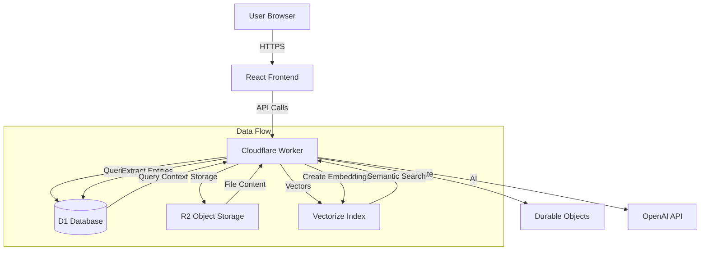

# LoreSmith AI

**AI-Powered Campaign Planning and Management Platform**

LoreSmith AI helps you organize your game campaign resources, plan sessions, and manage your world with intelligent AI assistance. Upload documents, create campaigns, and let AI help you prepare engaging adventures.

## 🧪 About This Project

LoreSmith was developed as an experimental project exploring two key areas:

1. **AI-Driven Vibecoding**: This project served as an exploration of AI-assisted development workflows, where AI tools were used extensively throughout the development process to rapidly prototype, iterate, and build features. The codebase demonstrates what's possible when AI pair programming is embraced as a core development methodology.

2. **Cloudflare Stack Exploration**: LoreSmith is a comprehensive exploration of Cloudflare's edge computing platform, utilizing the full suite of Cloudflare services:
   - **Workers** for serverless edge functions
   - **D1** for edge SQLite databases
   - **R2** for S3-compatible object storage
   - **Durable Objects** for stateful edge computing
   - **Vectorize** for vector similarity search
   - **Queues** for asynchronous processing

The project serves as both a functional application and a reference implementation for building complex, full-stack applications entirely on Cloudflare's edge platform. It demonstrates patterns for state management, data persistence, real-time features, and AI integration in an edge-first architecture.

## 🎯 What is LoreSmith?

LoreSmith is an AI-powered campaign planning tool that combines:

- **Intelligent Resource Library**: Upload and search through campaign materials using AI-powered semantic search
- **GraphRAG Technology**: Advanced knowledge graph that connects entities, relationships, and campaign context
- **Session Planning**: Get AI-assisted session outlines and campaign guidance
- **World State Tracking**: Automatically track changes to your campaign world as sessions progress

## ✨ Key Features

- **📚 Resource Library**: Upload PDFs, documents, and images (up to 500MB per file) with AI-powered extraction and indexing

  

- **🎲 Campaign Management**: Create and organize multiple campaigns with dedicated contexts

  

- **🤖 AI-Powered Chat**: Conversational AI assistant that understands your campaign context

  

- **🔍 Intelligent Search**: Semantic search across your resources and campaign content using GraphRAG
- **📝 Session Digests**: Automatically capture and track session summaries with world state changes
- **🌐 World Knowledge Graph**: Entity extraction and relationship mapping for comprehensive campaign understanding
- **🔐 Bring Your Own API Key**: Users provide their own OpenAI API key for full control over AI costs

## 🚀 Quick Start

### For Users

When you first access LoreSmith, you'll see a welcome screen that guides you through three main paths:


1. **Access the Application**: Navigate to your deployed LoreSmith instance
2. **Authenticate**:
   - Enter your username
   - Provide an admin key (if required)
   - Enter your OpenAI API key for AI features
3. **Get Started**:
   - Upload your first resource to build your library
   - Create a campaign to organize your content
   - Start chatting with the AI assistant for planning help

See our [User Guide](docs/USER_GUIDE.md) for detailed instructions and walkthroughs.

### For Developers

See our [Developer Setup Guide](docs/DEV_SETUP.md) for complete setup instructions.

#### Quick Setup

```bash
# Clone the repository
git clone https://github.com/ofisk/loresmith-ai.git
cd loresmith-ai

# Install dependencies
npm install

# Set up environment variables
cp .dev.vars.example .dev.vars
# Edit .dev.vars with your credentials

# Set up local database
./scripts/migrate-local.sh

# Build frontend (first time only)
npm run build

# Start development servers
npm run dev:cloudflare  # Terminal 1: Backend
npm start                # Terminal 2: Frontend
```

Access the application at `http://localhost:5173`

## 🏗️ Architecture

LoreSmith is built on modern serverless architecture for scalability and global performance:

### Core Technology Stack

- **Frontend**: React 19 with TypeScript, Vite, and Tailwind CSS
- **Backend**: Cloudflare Workers (serverless edge functions)
- **Database**: Cloudflare D1 (SQLite-based edge database)
- **Storage**: Cloudflare R2 (S3-compatible object storage)
- **State Management**: Cloudflare Durable Objects (distributed state)
- **AI**: OpenAI GPT-4 via AI SDK with user-provided API keys
- **Vector Search**: Cloudflare Vectorize for semantic similarity search

### System Architecture



## 📖 Documentation

### For Users

- **[User Guide](docs/USER_GUIDE.md)** - Complete guide for using LoreSmith
- **[Features Overview](docs/FEATURES.md)** - Detailed feature documentation

### For Developers

- **[Developer Setup](docs/DEV_SETUP.md)** - Complete development environment setup
- **[Architecture Overview](docs/ARCHITECTURE.md)** - System architecture deep dive
- **[GraphRAG Integration](docs/GRAPHRAG_INTEGRATION.md)** - How GraphRAG powers campaign queries
- **[API Documentation](docs/API.md)** - API endpoint reference
- **[Testing Guide](docs/TESTING_GUIDE.md)** - Testing documentation

### Technical Documentation

- **[Storage Strategy](docs/STORAGE_STRATEGY.md)** - Data storage architecture
- **[Authentication Flow](docs/AUTHENTICATION_FLOW.md)** - Authentication system details
- **[Model Configuration](docs/MODEL_CONFIGURATION.md)** - AI model configuration
- **[File Processing](docs/FILE_ANALYSIS_SYSTEM.md)** - File upload and processing pipeline

## 🔑 Authentication

LoreSmith uses JWT-based authentication with the following flow:

1. **User Authentication**: Username and admin key (if configured)
2. **API Key Provision**: Users provide their own OpenAI API key
3. **Session Management**: JWT tokens with 24-hour expiration
4. **Secure Storage**: API keys stored in Durable Objects, never in environment variables

See [Authentication Flow](docs/AUTHENTICATION_FLOW.md) for detailed documentation.

## 🎮 How It Works

### 1. Resource Upload & Processing

When you upload a file:

1. File is securely stored in R2 object storage
2. Content is extracted (PDFs, images, documents)
3. Entities are automatically extracted (NPCs, locations, items, etc.)
4. Content is indexed for semantic search
5. Entities are added to your campaign's knowledge graph

### 2. Campaign Context Assembly

When you query your campaign:

1. **GraphRAG Query**: Semantic search finds relevant entities in your knowledge graph
2. **Relationship Traversal**: Follows connections between entities
3. **Changelog Overlay**: Applies recent world state changes
4. **Planning Context**: Searches session digests for relevant history
5. **Unified Response**: Combines all context for comprehensive answers

See [GraphRAG Integration](docs/GRAPHRAG_INTEGRATION.md) for technical details.

### 3. Session Planning

The AI assistant helps you:

- Generate session outlines based on campaign context
- Track world state changes after sessions
- Maintain continuity across sessions
- Plan future encounters and story beats

## 🔧 Configuration

### Environment Variables

#### Local Development (`.dev.vars`)

```env
# OpenAI API Key (optional for development)
OPENAI_API_KEY=sk-your-key-here

# Admin Secret (required)
ADMIN_SECRET=your-admin-secret

# API URL
VITE_API_URL=http://localhost:8787

# CORS Origins
CORS_ALLOWED_ORIGINS=http://localhost:5173,http://localhost:5174
```

#### Production

Production uses Cloudflare Dashboard Environment Variables. The `ADMIN_SECRET` should be stored in Cloudflare Secrets Store.

### Available Scripts

```bash
# Development
npm start               # Start React dev server (frontend)
npm run dev:cloudflare  # Start Worker with remote resources (recommended)
npm run dev             # Start Worker with local resources only
npm run build           # Build production bundle

# Testing
npm test                # Run test suite
npm run validate        # Lint, type-check, and test

# Deployment
npm run deploy          # Deploy to production
npm run migrate         # Run database migrations
```

## 🔒 Security

- **JWT Authentication**: Secure token-based authentication
- **API Key Validation**: All OpenAI API keys are validated before use
- **Secure Storage**: Sensitive data stored in Durable Objects
- **Session Expiration**: Automatic cleanup of expired sessions
- **Edge Security**: All requests validated at the Cloudflare edge

## 🤝 Contributing

We welcome contributions! Please see our [Contributing Guide](docs/CONTRIBUTING.md) for details.

1. Fork the repository
2. Create a feature branch
3. Make your changes
4. Add tests for new functionality
5. Submit a pull request

## 📄 License

This project is licensed under the MIT License - see the [LICENSE](LICENSE) file for details.

## 🙋 Support

- **Documentation**: Check our [docs](docs/) directory
- **Issues**: Report bugs or request features on [GitHub Issues](https://github.com/ofisk/loresmith-ai/issues)
- **Discussions**: Join conversations on [GitHub Discussions](https://github.com/ofisk/loresmith-ai/discussions)

---

**Built with ❤️ for game masters and storytellers everywhere**
