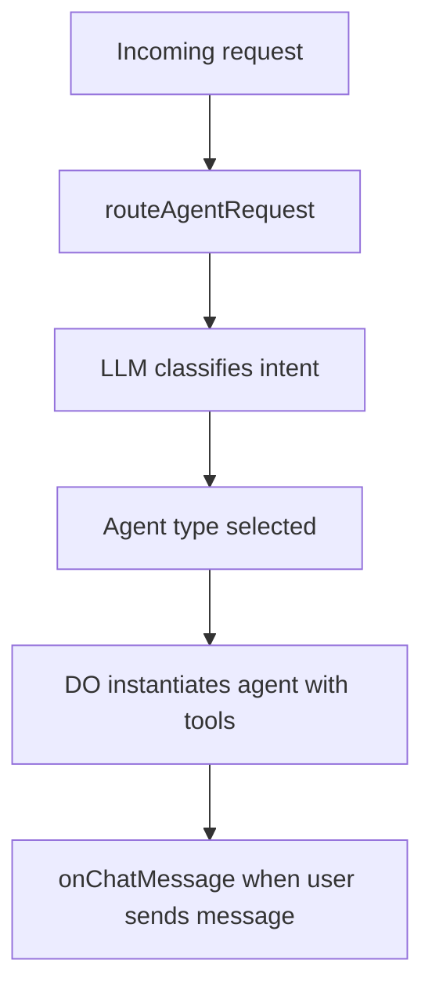
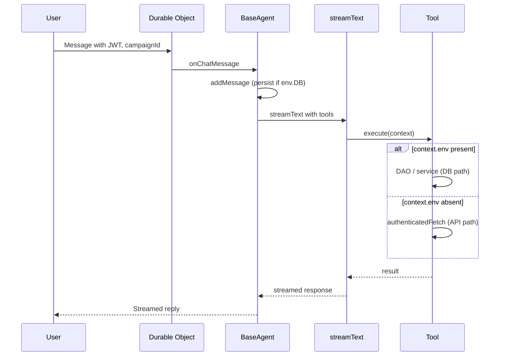

# Agent design

## Overview

Agents in LoreSmith run inside **Durable Objects** (one DO per chat session). They use a shared **BaseAgent** for message handling, tool execution, and token management. The **AgentRouter** selects which agent handles a request based on user intent.

### Request routing

### Chat and tool flow

## Agent types and routing

- **AgentRouter** (`src/lib/agent-router.ts`) maintains a registry of agent types (campaign, campaign-context, character, session-digest, etc.).
- Routing uses an LLM to classify user intent and pick an agent type; the DO then instantiates the corresponding agent class with that type’s tools and system prompt.
- See `AGENT_ROUTING_PROMPTS` and `routeAgentRequest` for how the routing request is built and executed.

## BaseAgent behavior

- **Constructor**: Takes Durable Object state (`ctx`), env (Cloudflare bindings), model, and tools. Subclasses pass their own tools and often override `agentMetadata`.
- **Message handling**: `addMessage` appends to in-memory history and persists to the database (message-history DAO) when `env.DB` is available.
- **Chat flow**: `onChatMessage` builds a minimal message context (current user message, last assistant message, essential system context), then calls `streamText` with the agent’s tools. JWT and `campaignId` are taken from the last user message’s `data`.
- **Tool execution**: Tools receive a `context` object that includes `env` when running inside the DO, so they can use the database directly. When `context.env` is missing (e.g. in tests or external calls), tools fall back to HTTP API with `authenticatedFetch`. See [TOOL_PATTERNS.md](./TOOL_PATTERNS.md).

## Token handling

- **Estimation**: Request and tool token counts are estimated (e.g. `estimateRequestTokens`, `estimateToolsTokens`, `getSafeContextLimit`) so the prompt stays within the model’s context window.
- **Trimming**: `trimToolResultsByRelevancy` (in `src/lib/tool-result-trimming.ts`) can trim large tool results (e.g. search/list) by relevancy score and importance so the context does not overflow. Tool descriptions encourage pagination (e.g. `listAllEntities` one page at a time) to avoid huge payloads.

## Overridable behavior

Subclasses can override:

- **agentMetadata**: `type`, `description`, `systemPrompt`, `tools` for registration and routing.
- **addMessage**: To change how messages are stored or filtered.
- **onChatMessage**: To change context building or streaming (rare).

System prompts and tool sets are defined per agent; base agent handles the common flow (JWT, campaignId, DB persistence, token limits, tool invocation).
