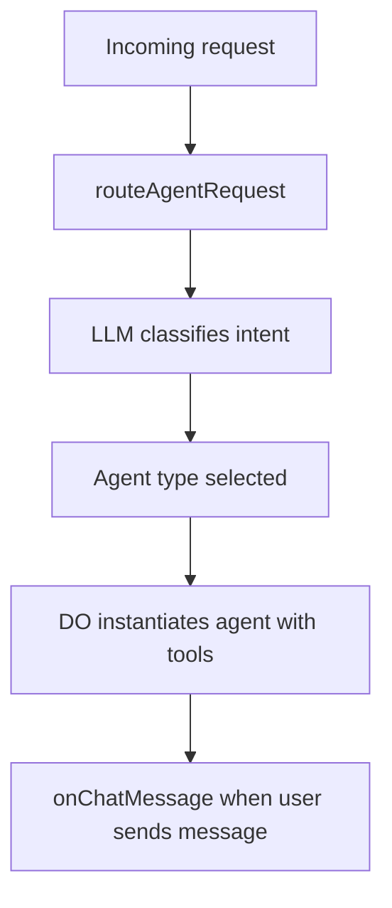
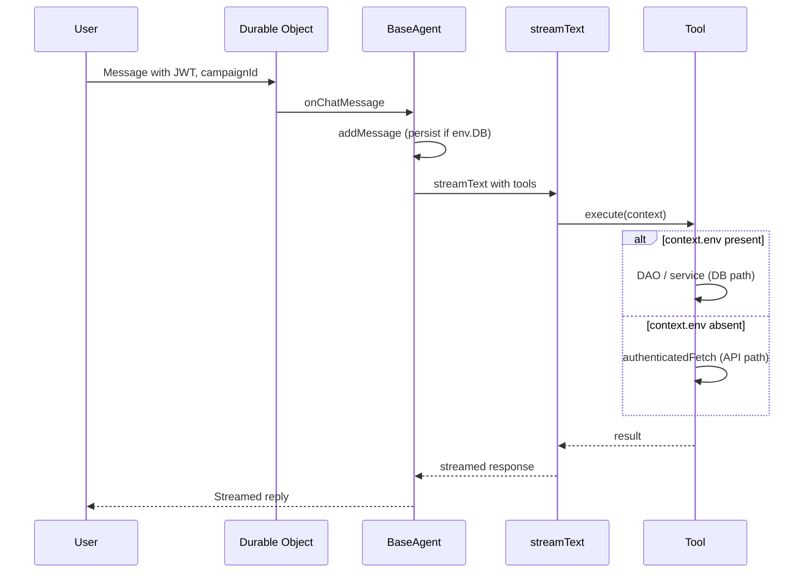
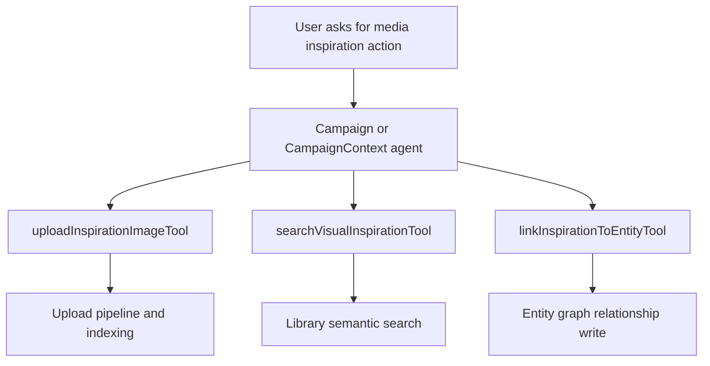
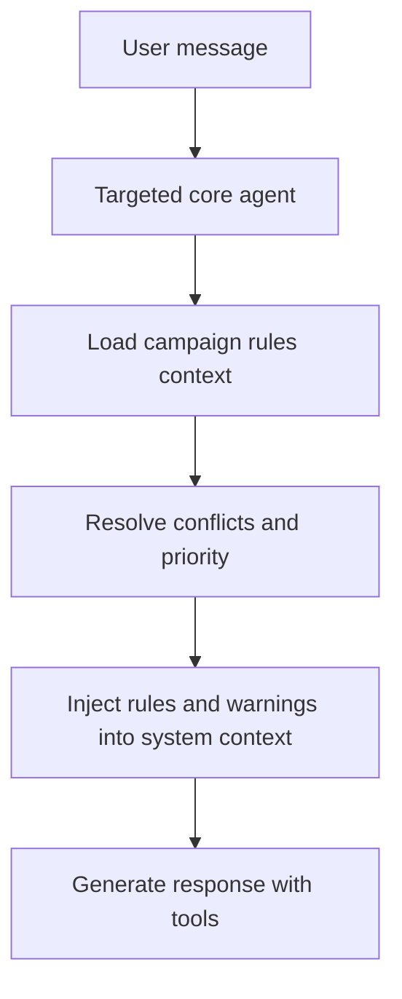

# Agent design

## Overview

Agents in LoreSmith run inside **Durable Objects** (one DO per chat session). They use a shared **BaseAgent** for message handling, tool execution, and token management. The **AgentRouter** selects which agent handles a request based on user intent.

### Request routing

```mermaid
flowchart TD
  Request[Incoming request] --> Route[routeAgentRequest]
  Route --> LLM[LLM classifies intent]
  LLM --> AgentType[Agent type selected]
  AgentType --> Instantiate[DO instantiates agent with tools]
  Instantiate --> OnChat[onChatMessage when user sends message]
```

### Chat and tool flow

```mermaid
sequenceDiagram
  participant User
  participant DO as Durable Object
  participant BaseAgent
  participant streamText
  participant Tool

  User->>DO: Message with JWT, campaignId
  DO->>BaseAgent: onChatMessage
  BaseAgent->>BaseAgent: addMessage (persist if env.DB)
  BaseAgent->>streamText: streamText with tools
  streamText->>Tool: execute(context)
  alt context.env present
    Tool->>Tool: DAO / service (DB path)
  else context.env absent
    Tool->>Tool: authenticatedFetch (API path)
  end
  Tool-->>streamText: result
  streamText-->>BaseAgent: streamed response
  BaseAgent-->>User: Streamed reply
```

### Media inspiration tool flow

```mermaid
flowchart TD
  UserPrompt[User asks for media inspiration action] --> Agent[Campaign or CampaignContext agent]
  Agent --> UploadTool[uploadInspirationImageTool]
  Agent --> SearchTool[searchVisualInspirationTool]
  Agent --> LinkTool[linkInspirationToEntityTool]
  UploadTool --> UploadApi[Upload pipeline and indexing]
  SearchTool --> LibrarySearch[Library semantic search]
  LinkTool --> EntityGraph[Entity graph relationship write]
```

### Rules-aware generation flow

```mermaid
flowchart TD
  UserMessage[User message] --> AgentSelect[Targeted core agent]
  AgentSelect --> LoadRules[Load campaign rules context]
  LoadRules --> ResolveRules[Resolve conflicts and priority]
  ResolveRules --> InjectRules[Inject rules and warnings into system context]
  InjectRules --> Generate[Generate response with tools]
```

Rule resolution details:

- Rule sources include `house_rule`, source `rules`, and rule-tagged conversational context.
- All rule inputs are normalized into one internal shape before injection.
- Conflict handling is contextual: agents keep both sides, emit warnings, and prefer table-specific rulings for generation.
- The same resolver is shared by agents and rule-aware tools to avoid behavior drift.

Why this helps game masters:

- House rulings stay sticky across sessions and agents.
- Conflicts are explicit, reducing silent contradictions in prep and play support.
- Responses remain transparent when multiple valid interpretations exist.

## Agent types and routing

- **AgentRouter** (`src/lib/agent-router.ts`) maintains a registry of agent types (campaign, campaign-context, character, loot-reward, session-digest, etc.).
- Routing uses an LLM to classify user intent and pick an agent type; the DO then instantiates the corresponding agent class with that type’s tools and system prompt.
- See `AGENT_ROUTING_PROMPTS` and `routeAgentRequest` for how the routing request is built and executed.

## BaseAgent behavior

- **Constructor**: Takes Durable Object state (`ctx`), env (Cloudflare bindings), model, and tools. Subclasses pass their own tools and often override `agentMetadata`.
- **Message handling**: `addMessage` appends to in-memory history and persists to the database (message-history DAO) when `env.DB` is available.
- **Chat flow**: `onChatMessage` builds a minimal message context (current user message, last assistant message, essential system context), then calls `streamText` with the agent’s tools. JWT and `campaignId` are taken from the last user message’s `data`.
- **Rules-aware injection**: For targeted agents (`campaign`, `campaign-context`, `campaign-analysis`, `recap`, `session-digest`), `onChatMessage` resolves campaign rules from multiple sources (`house_rule`, source `rules`, and rule-tagged context) and injects normalized rules plus conflict warnings before generation.
- **Tool execution**: Tools receive a `context` object that includes `env` when running inside the DO, so they can use the database directly. When `context.env` is missing (e.g. in tests or external calls), tools fall back to HTTP API with `authenticatedFetch`. See [TOOL_PATTERNS.md](./TOOL_PATTERNS.md).

## Token handling

- **Estimation**: Request and tool token counts are estimated (e.g. `estimateRequestTokens`, `estimateToolsTokens`, `getSafeContextLimit`) so the prompt stays within the model’s context window.
- **Trimming**: `trimToolResultsByRelevancy` (in `src/lib/tool-result-trimming.ts`) can trim large tool results (e.g. search/list) by relevancy score and importance so the context does not overflow. Tool descriptions encourage pagination (e.g. `listAllEntities` one page at a time) to avoid huge payloads.

## Overridable behavior

Subclasses can override:

- **agentMetadata**: `type`, `description`, `systemPrompt`, `tools` for registration and routing.
- **addMessage**: To change how messages are stored or filtered.
- **onChatMessage**: To change context building or streaming (rare).

System prompts and tool sets are defined per agent; base agent handles the common flow (JWT, campaignId, DB persistence, token limits, tool invocation).
