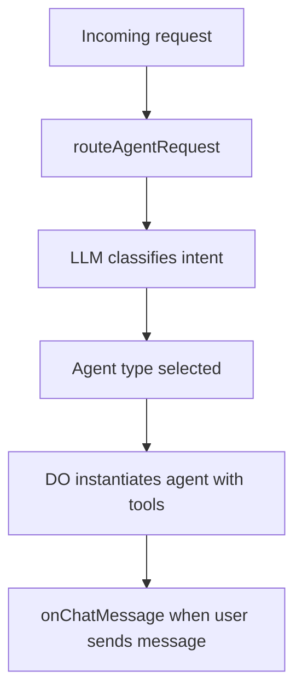
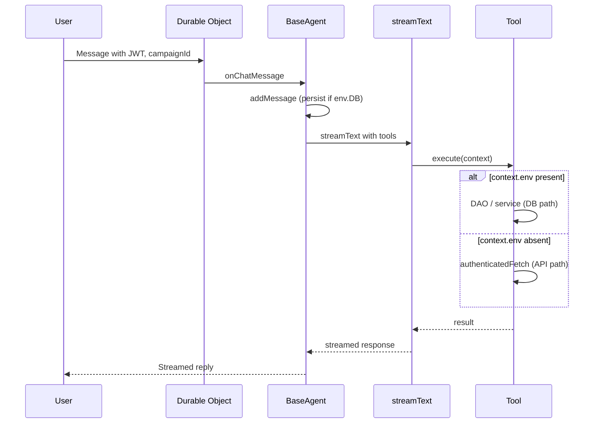
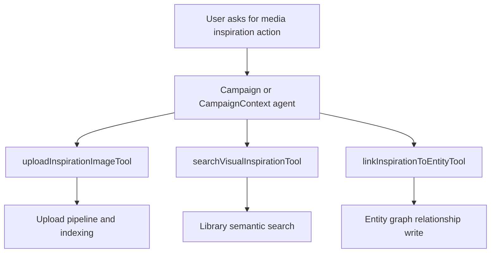
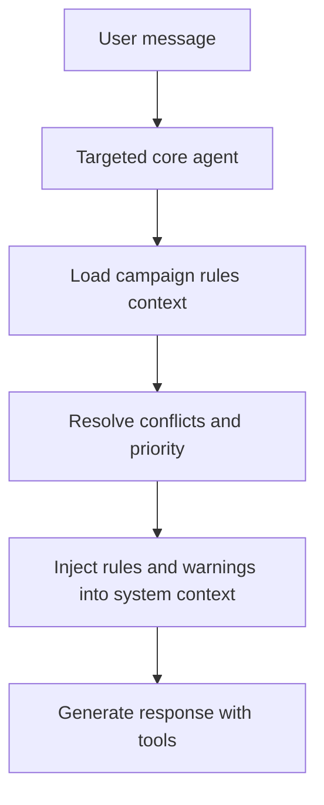
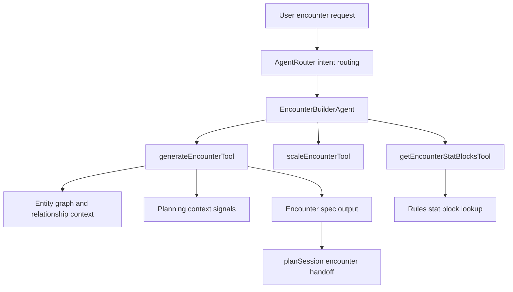
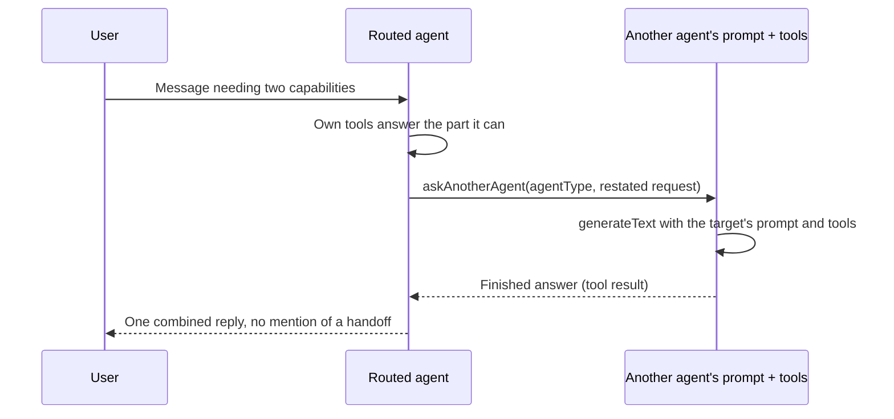

# Agent design

## Overview

Agents in LoreSmith run inside **Durable Objects** (one DO per chat session). They use a shared **BaseAgent** for message handling, tool execution, and token management. The **AgentRouter** selects which agent handles a request based on user intent.

### Request routing

```mermaid
flowchart TD
  Request[Incoming request] --> Route[routeAgentRequest]
  Route --> LLM[LLM classifies intent]
  LLM --> AgentType[Agent type selected]
  AgentType --> Instantiate[DO instantiates agent with tools]
  Instantiate --> OnChat[onChatMessage when user sends message]
```

### Chat and tool flow

```mermaid
sequenceDiagram
  participant User
  participant DO as Durable Object
  participant BaseAgent
  participant streamText
  participant Tool

  User->>DO: Message with JWT, campaignId
  DO->>BaseAgent: onChatMessage
  BaseAgent->>BaseAgent: addMessage (persist if env.DB)
  BaseAgent->>streamText: streamText with tools
  streamText->>Tool: execute(context)
  alt context.env present
    Tool->>Tool: DAO / service (DB path)
  else context.env absent
    Tool->>Tool: authenticatedFetch (API path)
  end
  Tool-->>streamText: result
  streamText-->>BaseAgent: streamed response
  BaseAgent-->>User: Streamed reply
```

### Media inspiration tool flow

```mermaid
flowchart TD
  UserPrompt[User asks for media inspiration action] --> Agent[Campaign or CampaignContext agent]
  Agent --> UploadTool[uploadInspirationImageTool]
  Agent --> SearchTool[searchVisualInspirationTool]
  Agent --> LinkTool[linkInspirationToEntityTool]
  UploadTool --> UploadApi[Upload pipeline and indexing]
  SearchTool --> LibrarySearch[Library semantic search]
  LinkTool --> EntityGraph[Entity graph relationship write]
```

### Rules-aware generation flow

```mermaid
flowchart TD
  UserMessage[User message] --> AgentSelect[Targeted core agent]
  AgentSelect --> LoadRules[Load campaign rules context]
  LoadRules --> ResolveRules[Resolve conflicts and priority]
  ResolveRules --> InjectRules[Inject rules and warnings into system context]
  InjectRules --> Generate[Generate response with tools]
```

Rule resolution details:

- Rule sources include `house_rule`, source `rules`, and rule-tagged conversational context.
- All rule inputs are normalized into one internal shape before injection.
- Conflict handling is contextual: agents keep both sides, emit warnings, and prefer table-specific rulings for generation.
- The same resolver is shared by agents and rule-aware tools to avoid behavior drift.

Why this helps game masters:

- House rulings stay sticky across sessions and agents.
- Conflicts are explicit, reducing silent contradictions in prep and play support.
- Responses remain transparent when multiple valid interpretations exist.

### Encounter builder agent flow

```mermaid
flowchart TD
  userRequest[User encounter request] --> router[AgentRouter intent routing]
  router --> encounterAgent[EncounterBuilderAgent]
  encounterAgent --> genTool[generateEncounterTool]
  encounterAgent --> scaleTool[scaleEncounterTool]
  encounterAgent --> statTool[getEncounterStatBlocksTool]
  genTool --> graphContext[Entity graph and relationship context]
  genTool --> planningContext[Planning context signals]
  genTool --> encounterSpec[Encounter spec output]
  encounterSpec --> planSession[planSession encounter handoff]
  statTool --> rulesLookup[Rules stat block lookup]
```

## Agent types and routing

- **AgentRouter** (`src/lib/agent-router.ts`) maintains a registry of agent types (campaign, campaign-context, character, loot-reward, encounter-builder, session-digest, etc.).
- Routing uses an LLM to classify user intent and pick an agent type; the DO then instantiates the corresponding agent class with that type’s tools and system prompt.
- See `AGENT_ROUTING_PROMPTS` and `routeAgentRequest` for how the routing request is built and executed.

## Cross-agent handoff

Routing picks one agent per turn, and that agent only holds its own tools. A request often needs more than one agent: "the core rulebook is added, what are The Foundling's trainings?" is a file question and a rules question in one sentence. Routing has to pick one, so the other half would otherwise go unanswered.

The user must never be asked to route their own request. Telling them to "ask that in your main campaign conversation" is a dead end - they do not know that specialists exist, and it also breaks the standing rule against revealing LoreSmith's internals.

So every agent gets an **`askAnotherAgent`** tool, injected in `createEnhancedTools` next to `submitSupportRequest`:

```mermaid
sequenceDiagram
  participant User
  participant Caller as Routed agent
  participant Delegate as Another agent's prompt + tools

  User->>Caller: Message needing two capabilities
  Caller->>Caller: Own tools answer the part it can
  Caller->>Delegate: askAnotherAgent(agentType, restated request)
  Delegate->>Delegate: generateText with the target's prompt and tools
  Delegate-->>Caller: Finished answer (tool result)
  Caller-->>User: One combined reply, no mention of a handoff
```

Details that matter when changing this:

- **No second Durable Object.** The delegate runs from the registry's system prompt and tools via `generateText`, not by constructing the target agent class. `BaseAgent.runDelegatedAgent` does this.
- **Role filtering is preserved.** `AgentRouter.getAgentToolsForRole` reads the target's own `getToolsForRole` off the prototype, so delegating cannot hand a player GM-only tools.
- **Auth context carries across.** The delegate's tools go through the caller's `createEnhancedTools`, so JWT, campaign, and claimed-player context are unchanged.
- **Handoffs do not nest.** Delegated runs get `allowDelegation: false`, so a delegate has no `askAnotherAgent` of its own. Delegated runs also use a tighter step budget (`MAX_DELEGATED_AGENT_STEPS`) than a top-level turn.
- **The delegate is blind to the conversation.** It receives only the `request` string, so that restatement must be self-contained.
- **The rule is enforced in the prompt too.** `AGENT_HANDOFF_SYSTEM_RULE` is appended to the system prompt whenever the tool is available, and `tests/agents/agent-prompt-no-deflection.test.ts` fails the build if any agent's prompt starts telling users to ask elsewhere.

## BaseAgent behavior

- **Constructor**: Takes Durable Object state (`ctx`), env (Cloudflare bindings), model, and tools. Subclasses pass their own tools and often override `agentMetadata`.
- **Message handling**: `addMessage` appends to in-memory history and persists to the database (message-history DAO) when `env.DB` is available.
- **Chat flow**: `onChatMessage` builds a minimal message context (current user message, last assistant message, essential system context), then calls `streamText` with the agent’s tools. JWT and `campaignId` are taken from the last user message’s `data`.
- **Rules-aware injection**: For targeted agents (`campaign`, `campaign-context`, `campaign-analysis`, `recap`, `session-digest`), `onChatMessage` resolves campaign rules from multiple sources (`house_rule`, source `rules`, and rule-tagged context) and injects normalized rules plus conflict warnings before generation.
- **Tool execution**: Tools receive a `context` object that includes `env` when running inside the DO, so they can use the database directly. When `context.env` is missing (e.g. in tests or external calls), tools fall back to HTTP API with `authenticatedFetch`. See [TOOL_PATTERNS.md](./TOOL_PATTERNS.md).
- **Activity logging**: The same `createEnhancedTools` wrapper records every tool call to the `agent_activity` table — agent, campaign, timing, status, and delegation linkage — with no per-agent instrumentation. See [AGENT_ACTIVITY.md](./AGENT_ACTIVITY.md).

## Token handling

- **Estimation**: Request and tool token counts are estimated (e.g. `estimateRequestTokens`, `estimateToolsTokens`, `getSafeContextLimit`) so the prompt stays within the model’s context window.
- **Trimming**: `trimToolResultsByRelevancy` (in `src/lib/tool-result-trimming.ts`) can trim large tool results (e.g. search/list) by relevancy score and importance so the context does not overflow. Tool descriptions encourage pagination (e.g. `listAllEntities` one page at a time) to avoid huge payloads.

## Overridable behavior

Subclasses can override:

- **agentMetadata**: `type`, `description`, `systemPrompt`, `tools` for registration and routing.
- **addMessage**: To change how messages are stored or filtered.
- **onChatMessage**: To change context building or streaming (rare).

System prompts and tool sets are defined per agent; base agent handles the common flow (JWT, campaignId, DB persistence, token limits, tool invocation).
