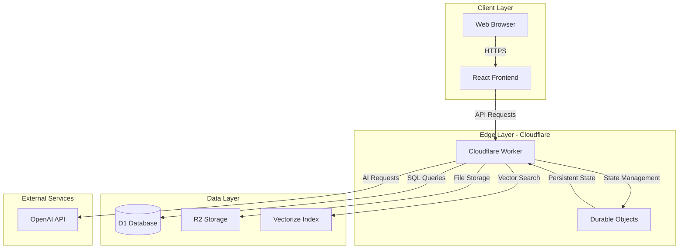
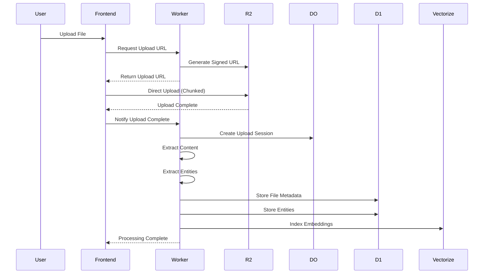
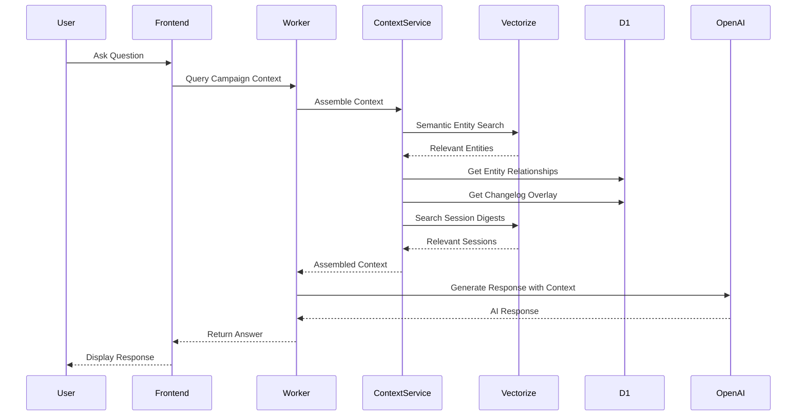
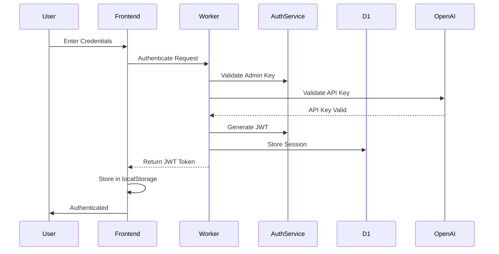
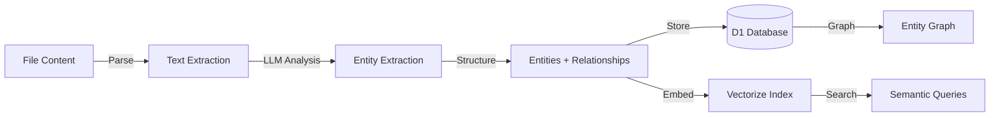
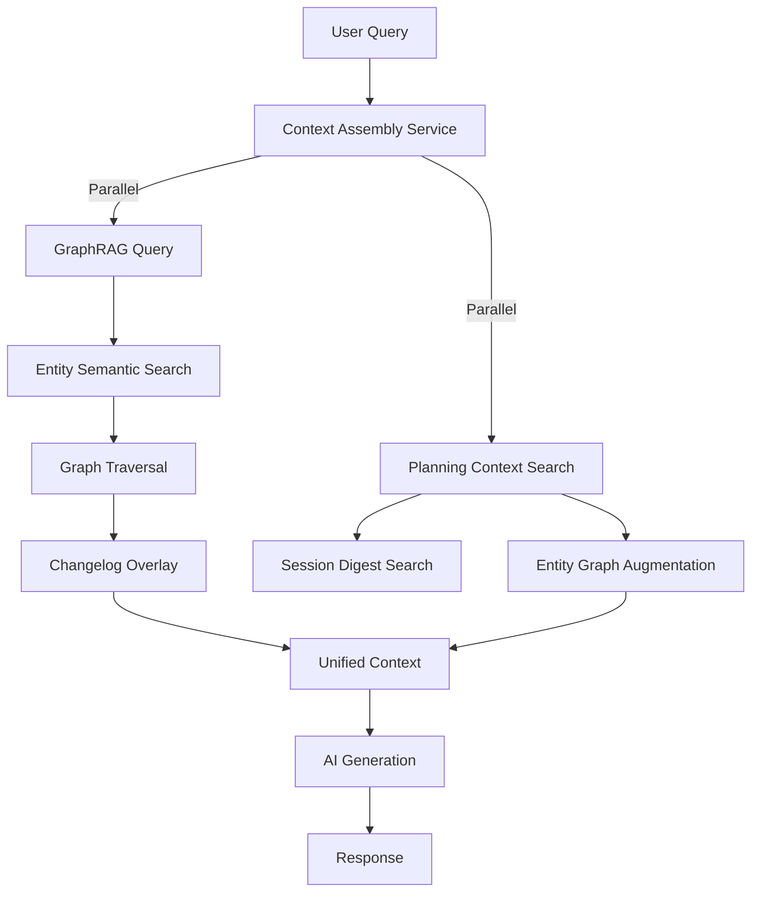
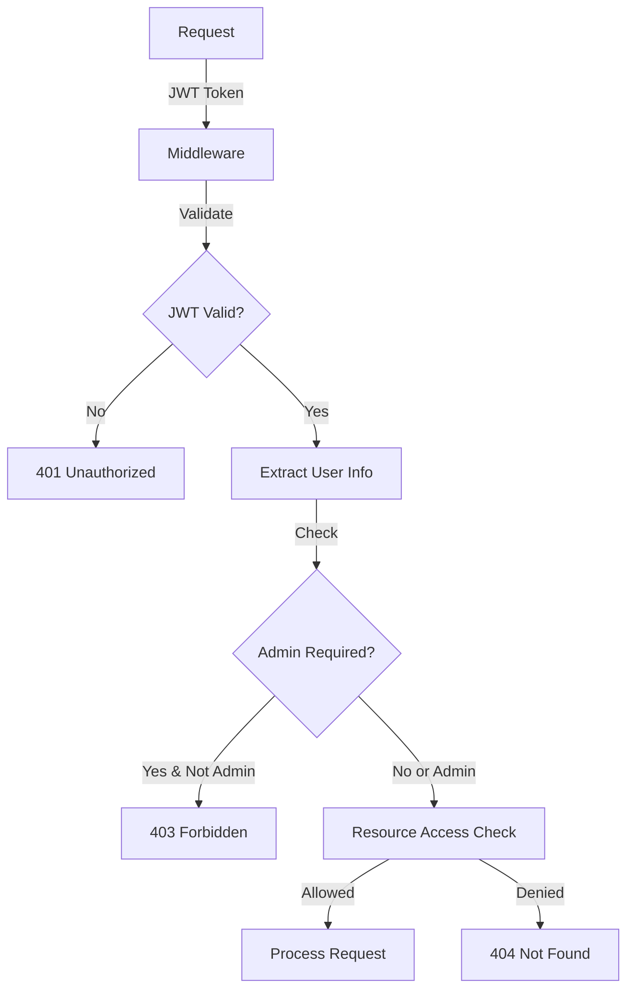

# LoreSmith AI Architecture

This document provides a comprehensive overview of LoreSmith AI's system architecture, components, and data flows.

## System Overview

LoreSmith AI is built on Cloudflare's edge computing platform, providing global scalability and low-latency performance. The architecture follows a serverless, edge-first approach.



## Core Components

### Frontend (React)

**Technology Stack:**

- React 19 with TypeScript
- Vite for build tooling
- Tailwind CSS for styling
- AI SDK React for AI interactions

**Key Features:**

- Real-time chat interface
- File upload with progress tracking
- Campaign management UI
- Entity visualization
- Session digest creation

### Backend (Cloudflare Worker)

**Technology:**

- Hono framework for routing
- TypeScript for type safety
- Edge runtime for global deployment

**Key Responsibilities:**

- API endpoint handling
- Authentication and authorization
- File upload orchestration
- AI request proxying
- Database queries
- Vector search coordination

### Data Storage

#### D1 Database (SQLite)

**Purpose:** Primary relational database

**Key Tables:**

- `campaigns` - Campaign metadata
- `file_metadata` - File information
- `entities` - Extracted entities (NPCs, locations, etc.)
- `entity_relationships` - Entity connections
- `session_digests` - Session summaries
- `world_state_changelog` - World state tracking
- `graphrag_telemetry` - System metrics

#### R2 Storage (Object Storage)

**Purpose:** File storage

**Structure:**

```
loresmith-files/
  └── library/
      └── {username}/
          └── {filename}
```

**Features:**

- Direct upload URLs for large files
- Chunked processing for large files
- Secure access via signed URLs

#### Vectorize (Vector Database)

**Purpose:** Semantic similarity search

**Indexes:**

- Entity embeddings for semantic search
- Session digest embeddings for context search

**Features:**

- High-dimensional vector storage
- Fast similarity search
- Automatic indexing

### State Management (Durable Objects)

**Durable Objects Used:**

1. **Chat DO**
   - Manages chat session state
   - Stores user OpenAI API keys securely
   - Maintains conversation history
   - Handles agent routing

2. **Notification Hub DO**
   - Manages real-time notifications
   - WebSocket connections
   - SSE event streaming

3. **Upload Session DO**
   - Tracks large file uploads
   - Manages chunk assembly
   - Progress tracking

## Data Flow Architecture

### File Upload Flow



### GraphRAG Query Flow



### Authentication Flow



## GraphRAG Architecture

### Entity Extraction Pipeline



### Context Assembly Process



**Context Tiers:**

1. **World Knowledge (GraphRAG)**
   - Base entity information from resources
   - Entity relationships and connections
   - Structural world knowledge

2. **World State Overlay (Changelog)**
   - Recent changes to entities
   - Updated relationships
   - New entities from sessions

3. **Planning Context (Session Digests)**
   - Historical session information
   - Recent events and developments
   - Temporal context for planning

## Security Architecture

### Authentication & Authorization



### Data Security

- **API Keys**: Stored in Durable Objects, never in environment variables
- **File Access**: Signed URLs with expiration
- **JWT Tokens**: 24-hour expiration, secure signing
- **Database**: Row-level access control via campaign ownership

## Performance Optimization

### Caching Strategy

- **Context Assembly**: 5-minute TTL cache per query
- **Entity Graph**: In-memory caching with invalidation
- **File Metadata**: Short-term caching for frequently accessed files

### Query Optimization

- **Parallel Execution**: Independent queries run in parallel
- **Vector Search**: Optimized similarity thresholds
- **Database Indexes**: Strategic indexes on frequently queried columns
- **Edge Deployment**: Low-latency responses via global edge network

### Scalability

- **Stateless Workers**: Horizontal scaling capability
- **Durable Objects**: Stateful scaling per user/campaign
- **Database Sharding**: Potential for campaign-based sharding
- **R2 Storage**: Unlimited file storage capacity

## Deployment Architecture

### Cloudflare Resources

```
Cloudflare Account
├── Worker (loresmith-ai)
│   ├── Routes: *.workers.dev, Custom Domain
│   └── Bindings:
│       ├── D1 Database
│       ├── R2 Bucket
│       ├── Vectorize Indexes
│       ├── Durable Objects
│       └── AI Gateway (Optional)
├── D1 Database (loresmith-db)
├── R2 Bucket (loresmith-files)
├── Vectorize Indexes
│   ├── entity-embeddings
│   └── session-embeddings
└── Durable Objects
    ├── Chat
    ├── NotificationHub
    └── UploadSession
```

### Environment Configuration

- **Development**: Local worker with remote resources
- **Production**: Deployed worker on Cloudflare edge
- **Staging**: Separate worker environment (optional)

## Monitoring & Observability

### Telemetry

- **Query Latency**: Track GraphRAG query performance
- **Rebuild Metrics**: Monitor knowledge graph rebuilds
- **Changelog Growth**: Track world state changes
- **User Satisfaction**: DM satisfaction ratings
- **Context Accuracy**: Measure AI response quality

### Logging

- **Worker Logs**: Available via Wrangler tail
- **Error Tracking**: Structured error logging
- **Performance Metrics**: Query timing and caching stats

## Future Architecture Considerations

### Potential Enhancements

- **Multi-tenant Support**: Enhanced isolation between users
- **Collaborative Features**: Shared campaigns and resources
- **Plugin System**: Extensible entity extraction
- **Advanced Caching**: Distributed cache layer
- **Analytics Dashboard**: User-facing analytics

---

For specific implementation details, see:

- [GraphRAG Integration](GRAPHRAG_INTEGRATION.md)
- [Storage Strategy](STORAGE_STRATEGY.md)
- [Authentication Flow](AUTHENTICATION_FLOW.md)
