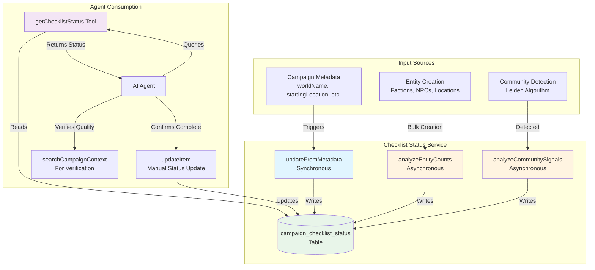
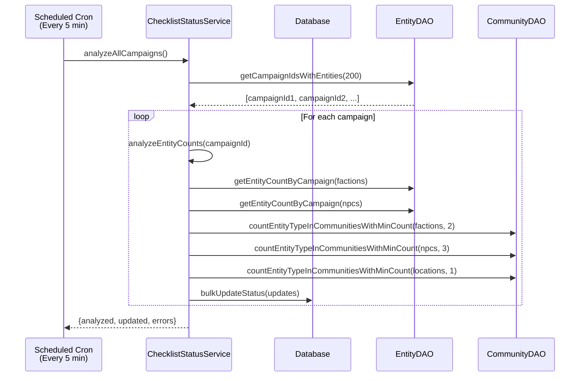
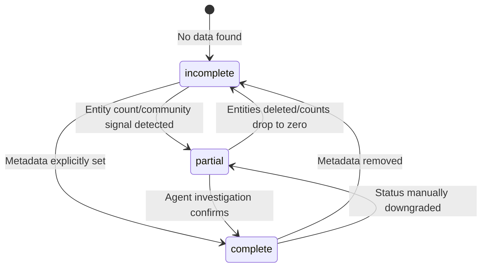
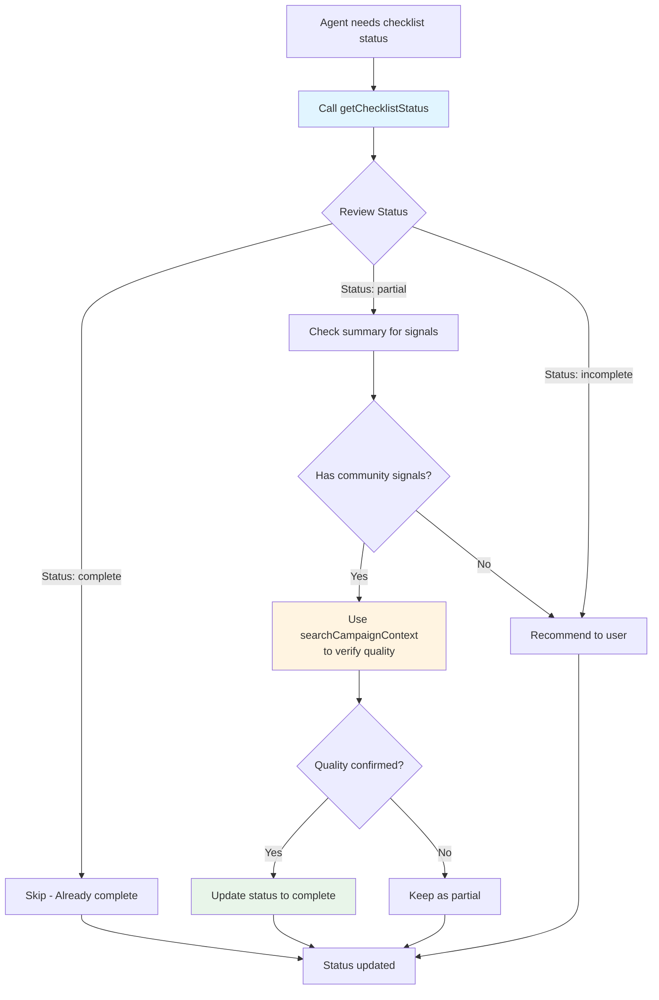

# Campaign Checklist Status System

## Overview

The `ChecklistStatusService` maintains structured status tracking for campaign planning checklist items. It provides agents with quick, efficient access to what's been completed in a campaign without requiring expensive semantic searches.

## Problem Statement

Previously, agents had to perform multiple broad semantic searches to determine which checklist items were already established in a campaign. This approach was:

- **Slow**: Multiple search queries per checklist assessment
- **Context-heavy**: Large search results consumed valuable context window space
- **Unreliable**: Semantic inference could miss or misinterpret existing content
- **Expensive**: Each search required embedding generation and vector similarity calculations

## Solution

The service maintains a structured `campaign_checklist_status` table that tracks:

- **Status**: `complete`, `partial`, or `incomplete` for each checklist item
- **Summary**: Brief text describing what exists for that item
- **Last Updated**: Timestamp for tracking freshness

This allows agents to quickly check checklist status with a single database query instead of multiple searches.

## System Architecture



## How It Works

### 1. Metadata-Based Updates

When campaign metadata is updated (via `updateCampaign`), the service automatically updates checklist status:

- `worldName` → `WORLD_NAME` checklist item marked as `complete`
- `startingLocation` → `STARTING_LOCATION` checklist item marked as `complete`
- `campaignTone` → `CAMPAIGN_TONE` checklist item marked as `complete`
- `campaignTheme`/`campaignThemes` → `CORE_THEMES` checklist item marked as `complete`

### 2. Entity Count Analysis

The service analyzes entity counts to provide preliminary signals:

- **Factions**: If 2+ factions exist, marks `FACTIONS` as `partial` (preliminary signal)
- **NPCs**: If 3+ NPCs exist, marks `STARTING_LOCATION_NPCS` as `partial` (preliminary signal)

**Important**: These are preliminary signals only. Counts alone don't indicate quality or completeness. The agent must investigate further.

### 3. Community Structure Analysis

The service uses Leiden algorithm community detection to provide quality signals:

- **Factions in Communities**: Counts factions that appear in communities with other factions (suggesting they're related/integrated)
- **NPCs in Communities**: Counts NPCs that appear in communities with other NPCs (suggesting they're related/integrated)
- **Locations in Communities**: Counts locations that appear in communities (suggesting they're part of a connected world)

**Why Communities Matter**: Communities represent clusters of related entities based on relationship graph structure. If multiple factions are in the same community, they're likely connected (opposition, support, shared goals, etc.). This is a stronger signal than just having 2+ factions that might be shallowly defined and unrelated.

### 4. Asynchronous Background Processing

Entity count and community analysis runs asynchronously via a scheduled cron job (every 5 minutes):

- Processes campaigns in batches (limit 200 per run)
- Uses efficient SQL queries (COUNT, targeted JOINs) instead of loading all entities
- Handles errors per-campaign without failing the entire batch
- Non-blocking: doesn't slow down entity creation or other operations



## Status Types

### Status State Machine



### `complete`

- Item is fully established and verified
- Set when metadata is explicitly provided (e.g., `worldName` in metadata)
- Can be set by agents after investigation confirms completeness

### `partial`

- Preliminary signal that something exists, but needs verification
- Set automatically based on entity counts or community structure
- Summary includes "Preliminary:" prefix to indicate it needs investigation
- Agent should use `searchCampaignContext` to verify quality and completeness

### `incomplete`

- Item is missing or not yet established
- Set when counts drop to zero (e.g., all factions deleted)

## Agent Workflow



1. **Check Status**: Agent calls `getChecklistStatus` to see what's already tracked
2. **Review Signals**: Sees preliminary signals (e.g., "Preliminary: 5 factions found. 3 factions are in communities together")
3. **Investigate**: Uses `searchCampaignContext` to verify if items are truly complete
4. **Update**: Can manually update status to `complete` if investigation confirms

## Key Design Decisions

### Why Preliminary Signals?

Entity counts alone aren't sufficient to determine completeness. A campaign might have:

- Dozens of shallowly-defined factions that aren't integrated
- NPCs that exist but aren't tied to the starting location
- Locations that aren't well-developed

The service provides **signals** that something might exist, but agents must investigate to confirm quality.

### Why Communities?

Communities detected by the Leiden algorithm represent clusters of related entities based on relationship graph structure. This provides a quality signal:

- **Factions in same community** → Likely related (opposition, support, shared goals)
- **NPCs in communities** → Likely part of a connected narrative
- **NPCs + Locations in same community** → NPCs likely tied to those locations

This is more meaningful than raw counts because it indicates integration and relationship.

### Why Asynchronous?

Entity creation often happens in bulk (hundreds at once during file processing). Synchronous analysis would:

- Slow down entity creation significantly
- Create performance bottlenecks
- Risk timeouts on large batches

Asynchronous processing via cron ensures:

- Entity creation remains fast
- Analysis happens in background
- System scales better

## Database Schema

```sql
CREATE TABLE campaign_checklist_status (
  id TEXT PRIMARY KEY,
  campaign_id TEXT NOT NULL,
  checklist_item_key TEXT NOT NULL,
  status TEXT NOT NULL CHECK (status IN ('complete', 'incomplete', 'partial')),
  summary TEXT,
  last_updated DATETIME DEFAULT CURRENT_TIMESTAMP,
  created_at DATETIME DEFAULT CURRENT_TIMESTAMP,
  UNIQUE(campaign_id, checklist_item_key)
);
```

## Future Enhancements

- Track more checklist items (e.g., starting location adventure locations, faction goals)
- Use community summaries to provide richer signals
- Track entity quality metrics (confidence scores, relationship density)
- Provide completion percentage for campaign readiness
