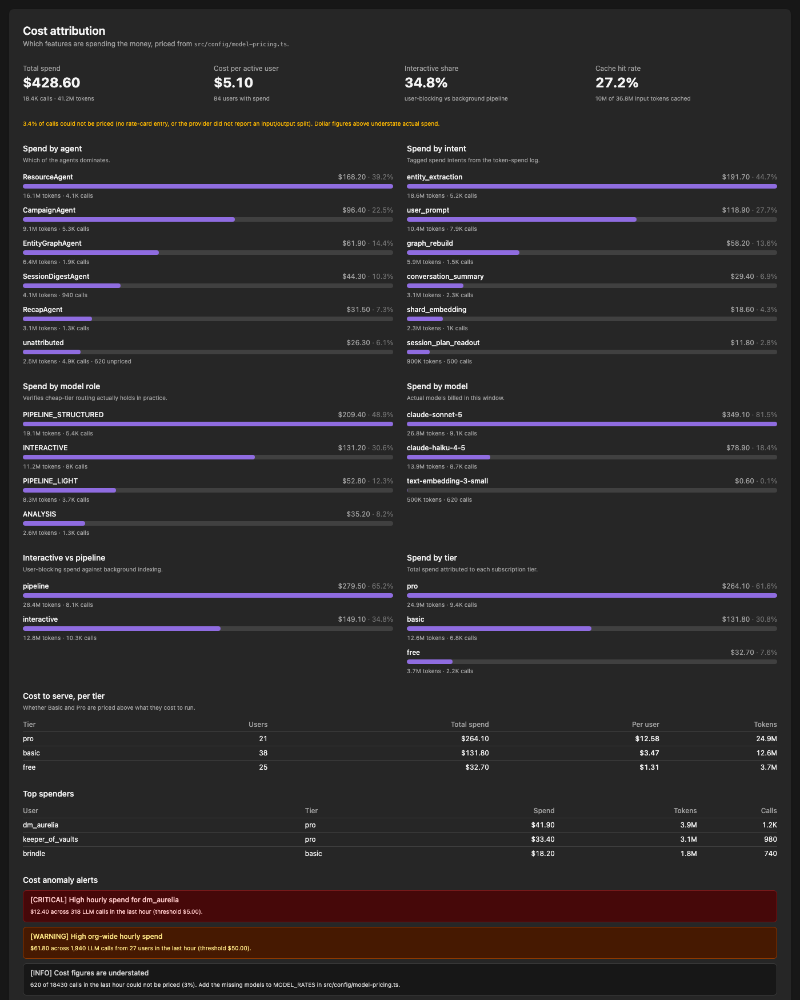
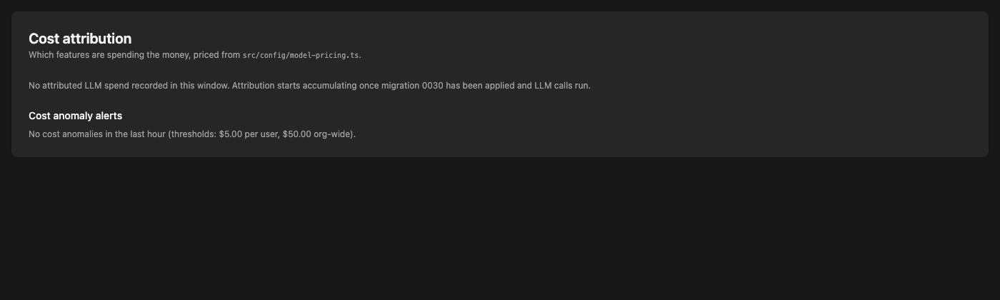

# Cost Attribution

Per-agent and per-intent LLM cost attribution for the admin telemetry dashboard.

The question this answers is **"which features are actually spending the money?"**
Model-tier decisions were previously made by reasoning about which paths *ought*
to be expensive; this makes that observable.



## Where to find it

Admin telemetry dashboard → **Cost attribution** (the first panel). Admin only.

- `GET /api/admin/telemetry/cost-attribution?fromDate=&toDate=&topN=&spenderLimit=`
- `GET /api/admin/telemetry/alerts`

## What it breaks spend down by

| Dimension | Question it answers |
|---|---|
| **Agent** | Which of the agents dominates |
| **Intent** | Which tagged spend intent dominates |
| **Model** | Which models are actually billed |
| **Model role** | Whether cheap-tier routing (`PIPELINE_LIGHT` etc.) holds in practice |
| **Interactive vs pipeline** | User-blocking spend vs background indexing |
| **Tier** | Cost to serve per subscription tier |

Plus a **cache hit rate** (cache reads as a share of all input tokens) — the
success metric for prompt-caching work — and a **cost per active user** per tier,
which is the number that says whether `SUBSCRIPTION_TIERS` pricing is solvent.

## How spend is recorded

Every LLM call funnels through `LLMRateLimitService.recordUsage()`. That method
already received `intent`, `source`, and `agent` metadata (from #678) but only
wrote it to logs. It now also writes a priced row to `llm_cost_events`.

```
provider call
  └─ onUsage({ tokens, queryCount, promptTokens, completionTokens,
               cachedInputTokens, cacheWriteTokens })
       └─ recordUsage(username, tokens, queryCount, model, meta)
            ├─ llm_usage_log      ← rate limiting (pruned at 25 hours)
            └─ llm_cost_events    ← attribution  (pruned at 90 days)
```

### Why a separate table

`llm_usage_log` is the rate-limiting ledger and is **pruned every 25 hours**. It
cannot answer "what did entity extraction cost last month". `llm_cost_events`
carries the attribution dimensions and a much longer retention horizon
(`COST_EVENT_RETENTION_DAYS`, pruned by the scheduled worker).

### Why the token split matters

Output tokens cost roughly 5x input tokens on every current model, so an
aggregate token count cannot be priced — a 90/10 input/output call and a 10/90
call with the same total differ by ~4x in dollars. The input/output/cached split
is therefore carried from the provider call through to the stored row.

When a provider does not report a split, the event is stored with `priced = 0`
rather than being priced from a guessed ratio. The dashboard reports that share
explicitly ("N% of calls could not be priced") instead of silently understating
spend.

## Pricing

Rates live in `src/config/model-pricing.ts` as USD per million tokens. Nothing
else in the app reads them, so a wrong rate skews dashboards but cannot affect
user-facing behaviour.

- Cache reads bill at ~0.1x input; cache writes at ~1.25x input (5-minute
  ephemeral TTL, which is what `anthropic-provider.ts` requests).
- Anthropic rates are published list prices. Claude Sonnet 5's introductory rate
  is deliberately **not** used, so tier-solvency decisions are made against the
  price we pay once the intro period ends.
- OpenAI rates are flagged `unverified`; the app defaults to Anthropic.

**Adding a model:** add an entry to `MODEL_RATES`. Dated snapshots
(`claude-haiku-4-5-20251001`) resolve to their base alias automatically.

## Cost anomaly alerts

`GET /api/admin/telemetry/alerts` returns alerts computed over the trailing hour.
They are derived on read, so there is no stored state and no stale alert can
outlive the spend that caused it.

| Alert | Fires when |
|---|---|
| `user_hourly_spend` | One user's spend crosses the per-user hourly threshold |
| `org_hourly_spend` | Combined spend crosses the org hourly threshold |
| `unpriced_spend` | Too large a share of calls has no rate-card entry |

Severity escalates to `critical` at 2x the threshold. Thresholds default to
`$5/user/hour` and `$50/org/hour` and are overridable per environment — see
`src/config/cost-alert-thresholds.ts`.

These are absolute dollar figures rather than being derived from
`SUBSCRIPTION_TIERS` on purpose: rate limits already stop a normal user from
exceeding their tier, so alerting at the tier ceiling would only fire on traffic
the system already allowed. The spend worth catching is the spend that bypasses
those limits — admin accounts (which skip `checkLimit`) and background pipeline
work.

## Schema

`llm_cost_events` (migration `0030_llm_cost_attribution.sql`):

| Column | Notes |
|---|---|
| `username`, `tier` | Tier is captured at spend time, so upgrades don't rewrite history |
| `intent`, `source`, `agent` | Attribution from `recordUsage` metadata |
| `model`, `provider`, `model_role` | `model_role` is the `TextGenerationTier` when the call site resolved one |
| `surface` | `interactive` or `pipeline`, derived from intent |
| `prompt_tokens`, `completion_tokens`, `cached_input_tokens`, `cache_write_tokens` | The priced split |
| `cost_usd`, `priced` | `priced = 0` distinguishes "free" from "could not price" |

> **New migrations must also be added to `scripts/d1/d1-bootstrap.sql`.** The
> bootstrap seeds `d1_migrations` from migration filenames, so a table that
> exists only in the migration will be marked applied but never created on a
> fresh database.

## Empty state

Before any spend is recorded — or on an environment that has not applied
migration 0030 — the panel degrades to an empty state rather than erroring.


