# LoreSmith AI Features

This document provides a comprehensive overview of LoreSmith AI's features and capabilities.

## Core Features

### Campaign management

**Campaign Creation & Organization**

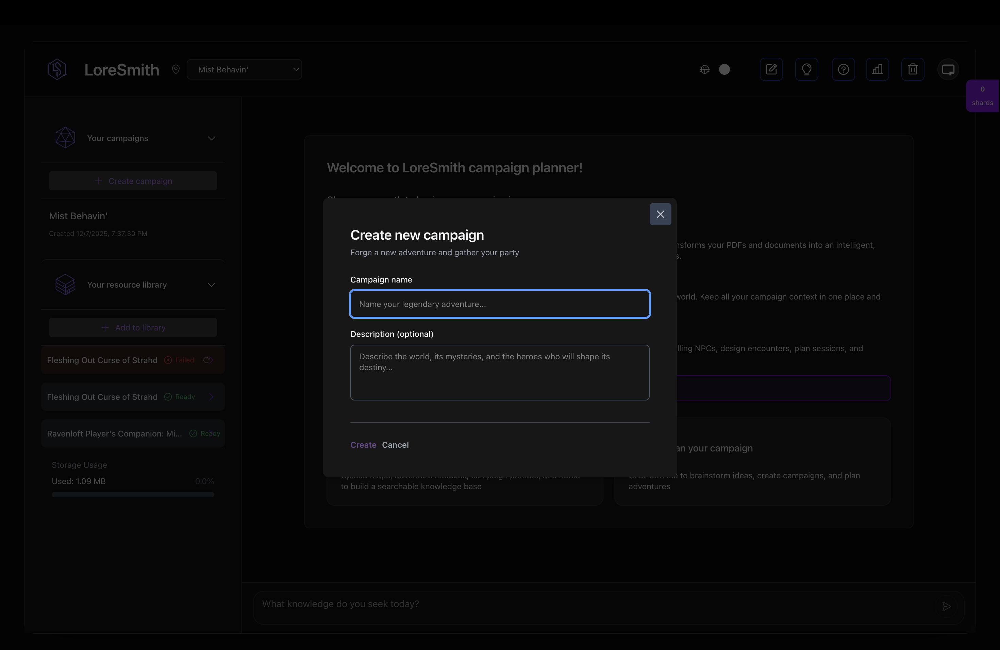

- Create unlimited campaigns
- Organize campaigns with names and descriptions
- Switch between campaigns seamlessly
- Campaign-specific context and resources
- Intuitive creation modal with optional descriptions

**Campaign Context**

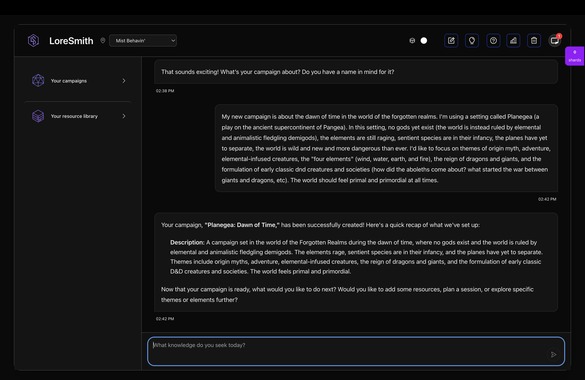

- Automatic context assembly from resources
- Entity relationship tracking
- World state management
- Session history integration
- Campaign selection dropdown drives AI responses
- AI can assist with campaign creation and setup

### Resource library

**File Upload & Storage**

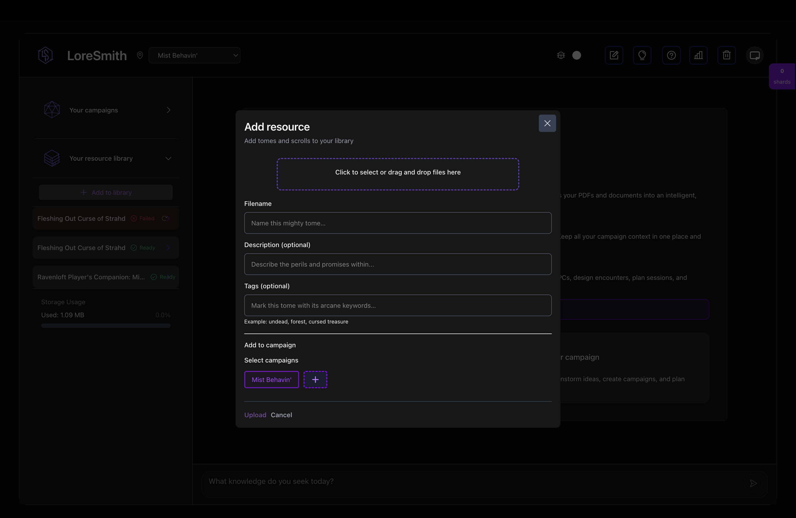

- Upload PDFs, documents, and images
- Support for files up to 100MB (Cloudflare Workers memory limit with buffer)
- Secure cloud storage
- Direct upload with progress tracking
- Intuitive upload modal with drag-and-drop support
- Optional metadata: filename, description, and tags
- Campaign association during upload

**Content Processing**

- Automatic text extraction from PDFs
- Vision-based image description for mood, style, and setting cues
- Entity extraction from content
- Semantic indexing for search
- **AI-powered metadata generation**: Automatic descriptions and tags based on file content
- Processing status tracking (Ready, Processing, Failed)
- Real-time status updates during processing
- Retry capability for failed processing

**Media inspiration tools**

- `uploadInspirationImageTool`: Uploads image references and triggers indexing
- `searchVisualInspirationTool`: Searches visual references by mood, setting, and style
- `linkInspirationToEntityTool`: Links inspiration resources to campaign entities via graph relationships

**Homebrew system tracker**

- `defineHouseRuleTool`: Creates a `house_rule` entity with category, text, and optional source mapping
- `listHouseRulesTool`: Lists active campaign rules across house and source rule types
- `updateHouseRuleTool`: Edits or deactivates existing house rules
- `checkHouseRuleConflictTool`: Detects conflicting rule statements and returns contextual warnings
- Targeted core agents (`campaign`, `campaign-context`, `campaign-analysis`, `recap`, `session-digest`) resolve rules before generation and surface conflict warnings when needed

**Rule resolution behavior**

- Rules are collected from multiple campaign sources, including house rules and source/canonical rules
- Rules are normalized into a common format before generation, so agents and tools read them consistently
- When conflicts are detected, the system returns a contextual warning and preserves both interpretations
- Generation prefers table-specific rules when they conflict with source defaults, while still exposing the conflict

**Benefit for game masters**

- Reduces accidental rules drift between sessions by applying the same resolution logic every time
- Makes contradictions visible early, so you can decide which ruling is authoritative
- Keeps assistants aligned with your table’s rulings without having to restate them each prompt
- Improves trust: responses explain when rules are ambiguous instead of silently picking one

**AI-Generated Metadata**

LoreSmith automatically generates rich metadata for uploaded files:

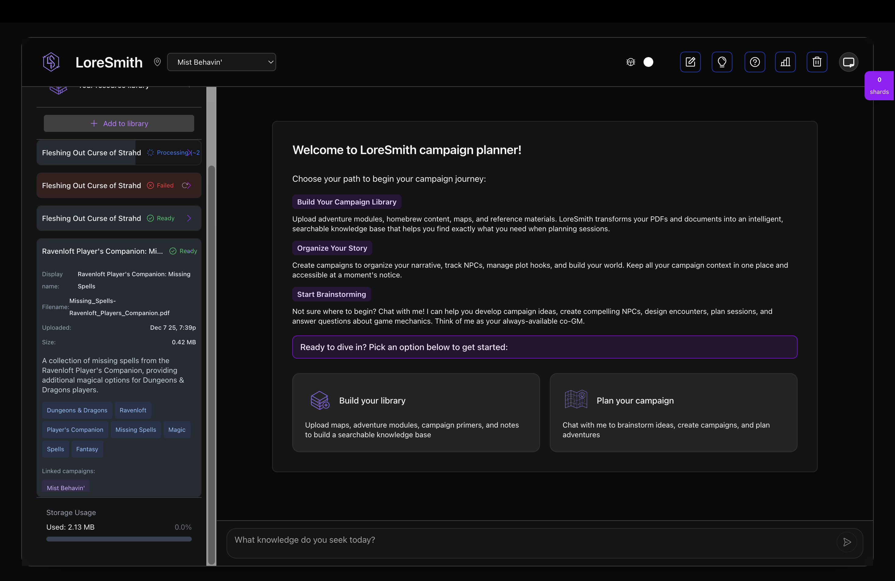

- Intelligent descriptions summarizing file content
- Relevant tags extracted from the content
- Editable metadata for customization

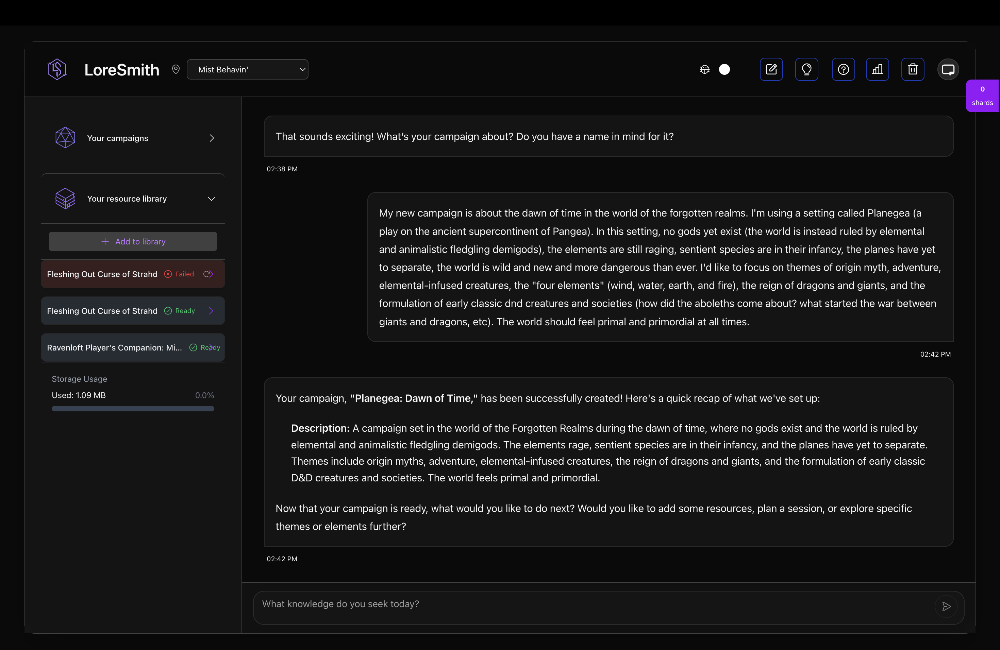

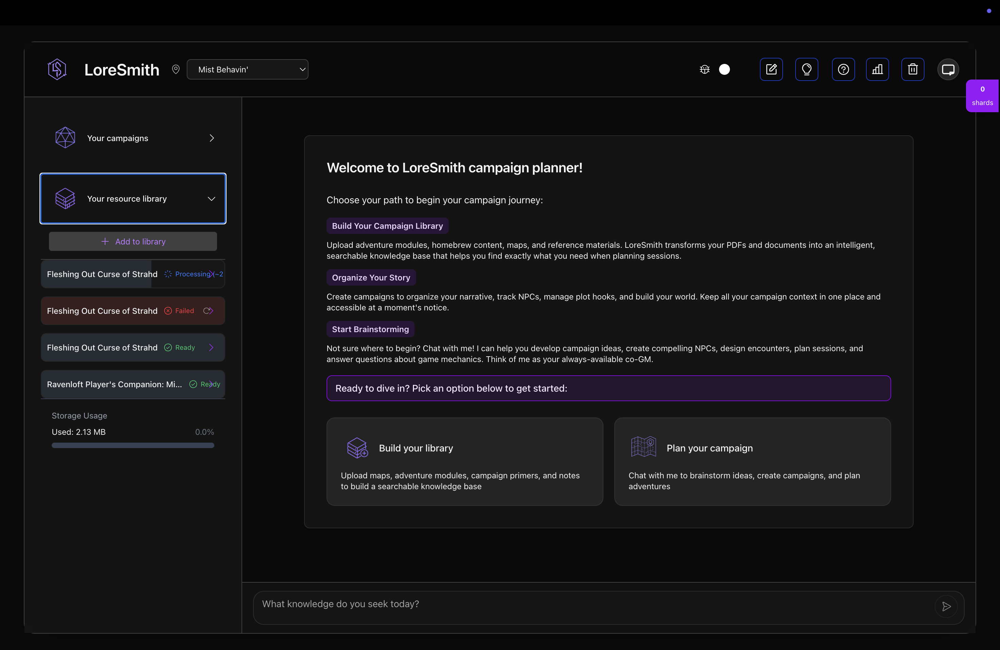

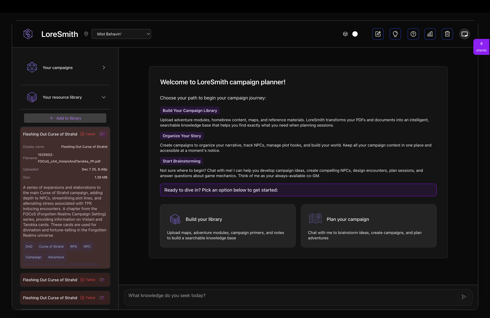

**Organization**

- Add files to multiple campaigns using an intuitive modal interface

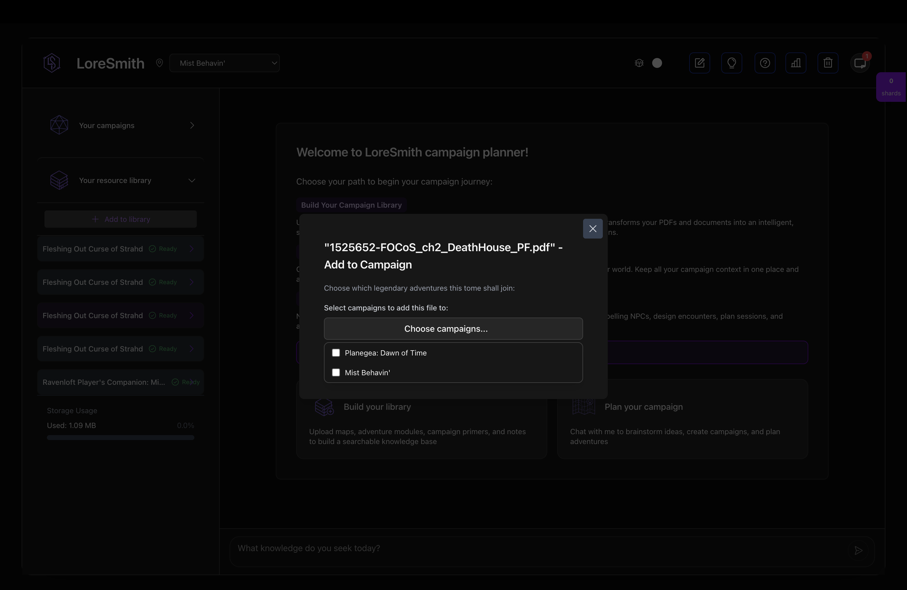

- Tag and categorize resources
- Search across all resources
- Filter by campaign, type, or tags

### AI-powered assistant

**Conversational Interface**

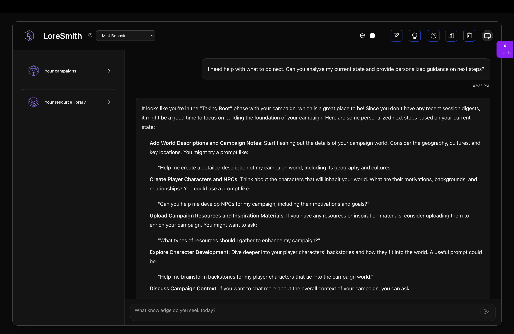

- Natural language chat interface
- Context-aware responses
- Campaign-specific knowledge
- Multi-turn conversations
- Personalized guidance via "Get help" feature

**Intelligent Responses**

- Understands your campaign context
- References uploaded resources
- Maintains conversation history
- Provides actionable suggestions
- Analyzes your current state to offer relevant next steps

### GraphRAG technology

**Knowledge Graph**

- Automatic entity extraction (NPCs, locations, items)
- Relationship mapping between entities
- Multi-hop graph traversal
- Entity similarity search

**Context Assembly**

- Combines multiple context sources
- World knowledge from resources
- Recent world state changes
- Session history integration

**Semantic Search**

- Meaning-based search (not just keywords)
- Finds related concepts
- Discovers entity connections
- Contextually relevant results

### Session planning

**Session Digests**

- Create session summaries
- Track world state changes
- Document NPC interactions
- Record player decisions

**Planning Assistance**

- Generate session outlines
- Suggest encounters and events
- Maintain campaign continuity
- Plan future story beats

**World State Tracking**

- Automatic entity status updates
- Relationship changes
- Location discoveries
- Plot progression tracking

**Loot and reward agent**

- `generateLootTool`: Generates encounter-appropriate treasure packages grounded in campaign context and tone
- `suggestMagicItemTool`: Suggests story-relevant magic item rewards for characters or situations
- `trackDistributedLootTool`: Records distributed rewards as `item` entities and links recipients/locations in the entity graph
- Supports follow-up campaign questions like "what rewards has the party already received?"

**Campaign timeline tools**

- `buildTimelineTool`: Builds a chronological timeline from session digests plus live/archived world state changelog entries
- `queryTimelineRangeTool`: Filters timeline events by date/session range or entity keywords with pagination support
- `addTimelineEventTool`: Adds manual GM timeline notes as metadata-marked changelog entries for out-of-session events
- Timeline output includes session markers, key events, world state changes, and open thread context

**Rules reference agent**

- `searchRulesTool`: Searches indexed campaign rule sources and house rules for cited excerpts relevant to a rules question
- `lookupStatBlockTool`: Finds creature or NPC stat block excerpts from indexed resources by name, with citations
- `resolveRulesConflictTool`: Resolves official vs house-rule precedence for a rules question and returns effective rule guidance
- Handles missing coverage by clearly indicating when the needed rulebook is not indexed

### Entity management

**Automatic Extraction**

- Extracts entities from uploaded resources
- Identifies relationships
- Creates knowledge graph nodes
- Builds entity network

**Entity Types**

- NPCs (Non-Player Characters)
- Locations (Cities, Dungeons, etc.)
- Items (Weapons, Artifacts, etc.)
- Organizations (Guilds, Factions, etc.)
- Events (Battles, Rituals, etc.)

**Relationship Tracking**

- Entity-to-entity connections
- Relationship types and strengths
- Temporal relationships
- Hierarchical structures

## Advanced Features

### Security and privacy

**Authentication**

- JWT-based secure authentication
- User-provided API keys
- Session management
- Secure data storage

**Data Privacy**

- API keys stored securely
- User data isolation
- Campaign access control
- Secure file uploads

### Performance

**Caching**

- Query result caching
- Context assembly caching
- Reduced API calls
- Faster response times

**Optimization**

- Parallel query execution
- Efficient vector search
- Database query optimization
- Edge deployment for low latency

### Analytics and monitoring

**Telemetry** (Admin Only)

- Query latency tracking
- Rebuild frequency monitoring
- Changelog growth metrics
- User satisfaction ratings
- Context accuracy measurement

**Dashboard**

- Visual metrics display
- Performance insights
- Usage statistics
- System health monitoring

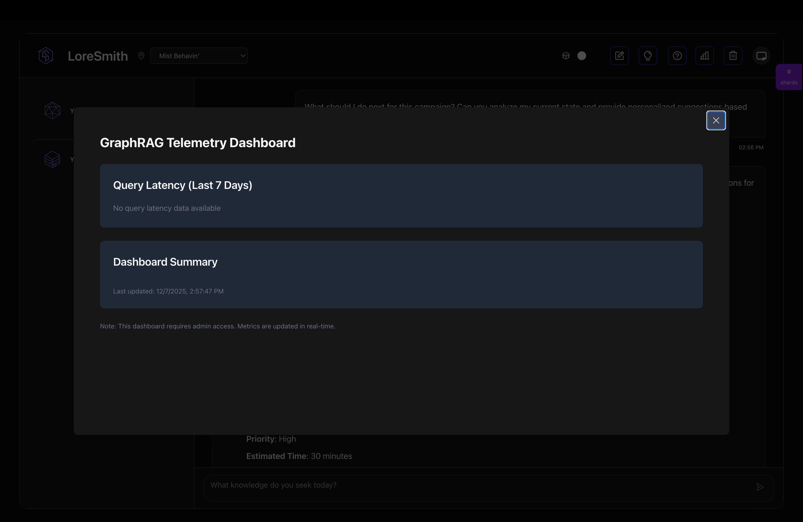

The admin dashboard is accessible to users who authenticate with the admin key. It provides comprehensive GraphRAG statistics and system telemetry, including:

- **Query Performance**: Query latency metrics with percentile breakdowns
- **Rebuild Metrics**: Graph rebuild duration and frequency tracking
- **Changelog Growth**: World state changelog entry counts over time
- **User Satisfaction**: DM satisfaction ratings and feedback
- **Context Accuracy**: Context accuracy measurements and trends

To access the admin dashboard, click the chart icon in the top header bar (visible only to admin users).

## User Experience Features

### Interface

**Modern UI**

- Clean, intuitive interface
- Dark mode support
- Responsive design
- Keyboard shortcuts

**Real-time Updates**

- Live file upload progress
- Instant search results
- Real-time notifications
- Streaming AI responses

### Notifications

**Progress Updates**

- File processing status
- Entity extraction progress
- Campaign rebuild status
- System notifications

**Real-time Events**

- SSE (Server-Sent Events) support
- WebSocket notifications
- Status change alerts
- Completion notifications

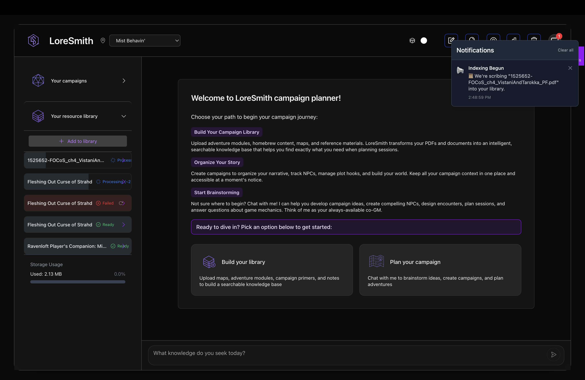

## Integration Features

### API access

**RESTful API**

- Complete API for all features
- Authentication via JWT
- Standard HTTP methods
- JSON responses

**Endpoints**

- Campaign management
- File upload and retrieval
- Entity queries
- Context assembly
- Session management

### Export and import

**Data Portability**

- Export campaign data
- Download resources
- Backup capabilities
- Migration support

## Future Features (Roadmap)

### Planned enhancements

- **Collaboration**: Shared campaigns and resources
- **Templates**: Campaign and resource templates
- **Plugins**: Extensible entity extraction
- **Mobile App**: Native mobile application
- **Offline Mode**: Limited offline functionality
- **Advanced Analytics**: User-facing analytics dashboard
- **Integration**: Third-party tool integrations

---

For detailed information on using these features, see the [User Guide](USER_GUIDE.md).
For technical implementation details, see [Architecture Overview](ARCHITECTURE.md).
