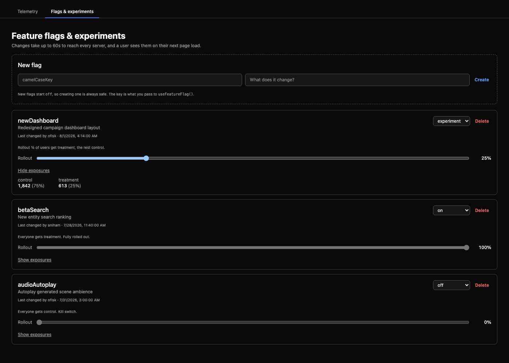

# Feature flags and A/B experiments

Flags live in D1 and are toggled from the admin UI. **Flipping one does not need a deploy.**

One table backs both flags and experiments, because they are the same object at different rollout percentages:

| Status | Who gets the new experience | Use it for |
| --- | --- | --- |
| `off` | nobody — everyone gets `control` | a kill switch, or a flag that is not ready |
| `on` | everyone — `treatment` | a fully rolled-out feature |
| `experiment` | `rollout_pct` % of users | a gradual rollout, or an A/B test |

## Managing flags

Sign in as an admin, open the admin dashboard from the header, and pick the **Flags & experiments** tab. From there you can create a flag, change its status, drag its rollout percentage, and see per-arm exposure counts.

New flags are created `off`, so creating one can never change behavior. The key you choose is the string you pass to `useFeatureFlag()`.



**Changes take up to 60 seconds to reach every server**, and a user sees them on their next page load. See [Caching](#caching) for why.

## In the app

**React:**

```tsx
import { useFeatureFlag, useVariant } from "@/lib/feature-flags-react";

function MyComponent() {
  const showNewDashboard = useFeatureFlag("newDashboard");
  return showNewDashboard ? <NewDashboard /> : <OldDashboard />;
}

// When the two arms are different experiences rather than on/off:
function Headline() {
  const variant = useVariant("headlineCopy");
  return <h1>{variant === "treatment" ? "New copy" : "Old copy"}</h1>;
}
```

**Plain JS/TS** (unchanged signature — these stay synchronous):

```ts
import { isFeatureEnabled, getVariant, getFeatureFlags } from "@/lib/feature-flags";

if (isFeatureEnabled("newDashboard")) {
  // show new dashboard
}

getVariant("headlineCopy"); // "control" | "treatment" | ...
getFeatureFlags();          // all flags, for debugging
```

**Worker (server) side:**

```ts
import { getDAOFactory } from "@/dao/dao-factory";
import { ExperimentService } from "@/services/experiment-service";

const experiments = new ExperimentService(getDAOFactory(env).experimentDAO);
if (await experiments.isEnabled("newDashboard", username)) {
  // ...
}
```

The service has supported this since day one, but the worker has no ambient "current user" in every code path — queue consumers and cron jobs run with nobody logged in. Adopt it where you already have a `username` in hand; do not thread one through just to check a flag.

## How it works

1. `experiments` (D1, `migrations/0034_experiments.sql`) holds one row per flag.
2. `GET /api/experiments/assignments` resolves every flag for the authenticated user and returns a `key -> variant` map plus its boolean projection.
3. `ExperimentProvider` (mounted in `src/client.tsx`) fetches that map once at app start. It seeds both the React context — so components re-render when it lands — and a module-level cache in `src/lib/feature-flags.ts`, so the synchronous non-React helpers see the same answer.
4. `useFeatureFlag` / `isFeatureEnabled` read from that map.

### Bucketing

`experiment`-status flags bucket users with `hash(key + ":" + username) % 100 < rollout_pct` (`src/lib/experiment-bucketing.ts`). There is no assignments table. That buys three properties:

- **Sticky.** The same user always lands in the same bucket, across sessions and devices, with no storage and no read on the hot path.
- **Monotonic.** The bucket does not depend on `rollout_pct`, so raising 10% → 25% only *adds* users to treatment. Nobody who already saw the new experience gets pulled back mid-rollout. A naive random-assignment table does not give you this.
- **Independent.** The key is part of the hash, so a user in treatment for one experiment is not correlated into treatment for the next.

The trade-off, accepted knowingly: assignments cannot be *frozen*. Changing the hash function, or renaming an experiment's key, reshuffles everyone. If we ever need frozen assignments across such a change, we have to add the table after all.

`username` is the bucketing key because it is `not null unique` on `users` and already present in the JWT payload, so no token change was needed.

### Caching

`wrangler.jsonc` binds R2, D1, Vectorize, AI and queues — there is **no KV namespace**, so there is nowhere faster than the isolate itself to cache. `ExperimentService` keeps a module-scope snapshot of the whole table with a 60-second TTL, keyed by the D1 binding. A hot path with N flag checks costs at most one D1 query per minute per isolate.

Consequences worth knowing:

- An emergency kill switch takes up to 60s to reach every isolate. The admin UI says so rather than pretending toggles are instant.
- Admin writes invalidate the snapshot immediately, so an admin sees their own toggle at once.
- If D1 is briefly unreadable, the stale snapshot is served rather than failing every request that reads a flag.

Revisit KV only if we need faster propagation.

### Fallback

If the assignments fetch fails, reads fall through to the deprecated build-time values rather than flipping everything off — a network blip must not silently disable every feature at once.

The layering is: **a key the server has an opinion about wins; a key it has never heard of still reads from the build-time layer.** That is what lets flags move into the table one row at a time.

## Measurement

A toggle without measurement is a feature flag, not an A/B test.

- `experiment_exposure` telemetry is recorded once per user per session, for `experiment`-status flags only, when the assignments endpoint resolves their map. That is the per-arm denominator. `on`/`off` flags have a single arm, so counting their exposures would carry no information.
- `TelemetryService.withExperimentVariants(map)` stamps the caller's arms into `metadata.experiments` on every metric it records afterwards. This is opt-in per request rather than global, because background paths record metrics with nobody logged in and stamping them with someone else's arms would corrupt the comparison.
- `GET /api/admin/experiments/:key/results?metricType=&days=` reports exposures per arm and, optionally, one outcome metric split the same way. The admin panel shows the exposure half.

v1 reports **raw per-arm numbers only**. Statistical significance testing is out of scope; calling a winner stays a human judgment.

## API

| Method | Path | Who |
| --- | --- | --- |
| `GET` | `/api/experiments/assignments` | any authenticated user |
| `GET` | `/api/admin/experiments` | admin |
| `POST` | `/api/admin/experiments` | admin |
| `PATCH` | `/api/admin/experiments/:key` | admin |
| `DELETE` | `/api/admin/experiments/:key` | admin |
| `GET` | `/api/admin/experiments/:key/results` | admin |

Admin routes chain `requireUserJwt` then `requireAdmin` (`src/routes/auth.ts`). A non-admin gets 403 on every one of them.

## Known limits

- **Logged-out users cannot be experimented on.** Bucketing needs a username, and pre-auth surfaces (landing, signup) do not have one. Splitting traffic there would need an anonymous-id cookie — out of scope for v1.
- **Two arms.** The `variants` column is a JSON array and already allows more, but a single `rollout_pct` cannot describe a three-way split. Widening it later is a code change, not a migration.
- **No targeting rules** beyond percentage rollout. No by-tier, by-campaign or by-signup-date targeting.

## Deprecated: the build-time `FEATURES` variable

Flags used to be a `FEATURES` JSON variable in GitHub Actions, baked into the bundle as `VITE_FEATURES` and parsed once at module load. That path still exists, **as a fallback layer only**:

- Do not add new flags there. Create them in the admin UI.
- The GitHub `FEATURES` variable is deprecated and should be removed once no flag depends on it.
- Its only remaining job is answering flag checks before the assignments fetch lands, or after it fails.
