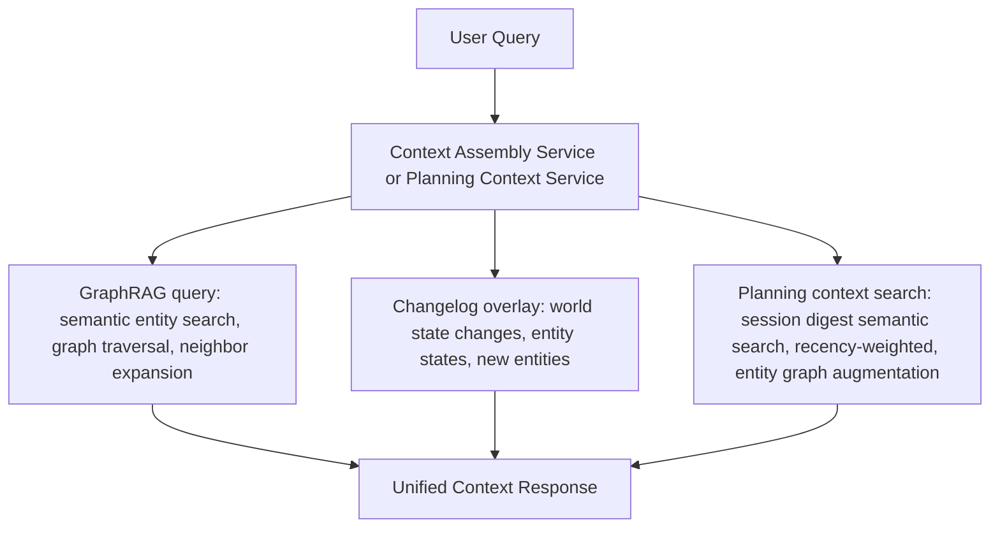
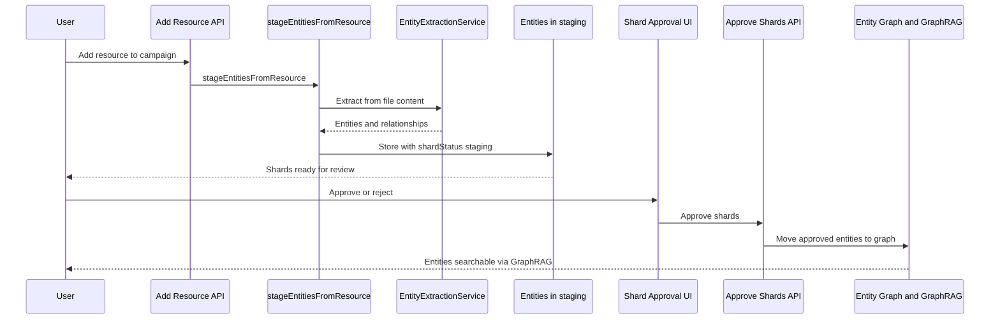
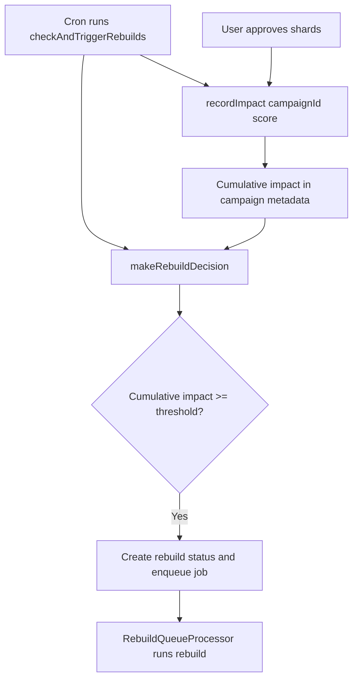
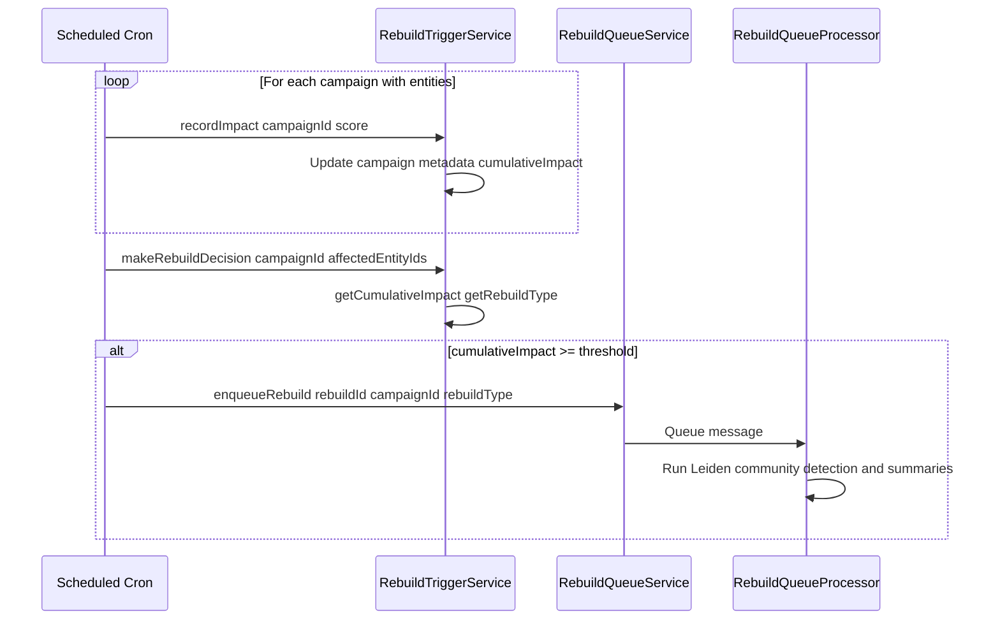

# GraphRAG Integration

## Overview

The LoreSmith AI campaign system uses GraphRAG (Graph-based Retrieval Augmented Generation) for intelligent campaign context search and world knowledge retrieval. This system combines entity graphs, semantic embeddings, and relationship traversal to provide comprehensive context for DM planning sessions.

## Architecture

### Core Components

1. **Entity Graph Service** (`EntityGraphService`)
   - Manages entity relationships and graph traversal
   - Provides neighbor discovery and relationship queries
   - Supports multi-hop graph traversal for context expansion

2. **Entity Embedding Service** (`EntityEmbeddingService`)
   - Generates semantic embeddings for entities
   - Enables semantic similarity search across entities
   - Uses Vectorize for efficient vector search

3. **Planning Context Service** (`PlanningContextService`)
   - Searches session digests with semantic similarity
   - Applies recency weighting to prioritize recent sessions
   - Augments results with entity graph context
   - Combines session recap content with entity relationships

4. **Context Assembly Service** (`ContextAssemblyService`)
   - Orchestrates multiple context tiers at query time
   - Combines GraphRAG world knowledge + changelog overlays + planning context
   - Provides unified context assembly for DM planning
   - Includes caching for performance optimization

5. **World State Changelog Service** (`WorldStateChangelogService`)
   - Tracks structural changes to entities, relationships, and locations
   - Applies overlays to base world knowledge
   - Maintains current world state view

### Integration Flow



## Entity Extraction and Graph Building

### Automatic Entity Extraction

When resources are added to campaigns, entities are automatically extracted:

1. **Resource Addition** (`handleAddResourceToCampaign`)
   - File is added to campaign
   - `stageEntitiesFromResource` is called automatically
   - Entities are extracted from file content using `EntityExtractionService`

2. **Entity Staging** (`entity-staging-service.ts`)
   - Extracts structured entities (NPCs, locations, items, monsters, etc.)
   - Creates entities in the graph with relationships
   - Entities are stored with `shardStatus: "staging"` for user approval

3. **Entity Approval**
   - User approves/rejects entities through shard approval UI
   - Approved entities become searchable via GraphRAG
   - Relationships are preserved and traversable

#### Entity extraction and approval sequence



### Manual Entity Extraction

Entities can also be extracted manually via:

- **`extractEntitiesFromContentTool`** - Extract entities from text content
- **`EntityExtractionPipeline`** - Programmatic entity extraction
- **API endpoints** - `/campaigns/:campaignId/entities/extract`

## Query Types

### 1. Planning Context Search

Searches session digests and world state with entity graph augmentation:

**Service**: `PlanningContextService`

**Features**:

- Semantic similarity search over session digests
- Recency weighting (recent sessions prioritized)
- Entity graph context augmentation
- World state changelog integration

**Usage**:

```typescript
const results = await planningContextService.search({
  campaignId: "campaign-id",
  query: "What happened with the Black Dragon?",
  limit: 10,
  applyRecencyWeighting: true,
});
```

**API Endpoint**: `POST /campaigns/:campaignId/planning-context/search`

### 2. Context Assembly

Combines all context tiers for comprehensive DM planning:

**Service**: `ContextAssemblyService`

**Features**:

- GraphRAG world knowledge query
- Changelog overlay application
- Planning context search
- Caching for performance
- Parallel query execution

**Usage**:

```typescript
const context = await contextAssemblyService.assembleContext(
  "What should I prepare for next session?",
  "campaign-id",
  {
    maxEntities: 10,
    maxNeighborsPerEntity: 5,
    maxPlanningContextResults: 5,
  }
);
```

**API Endpoint**: `POST /campaigns/:campaignId/context-assembly`

**Response Structure**:

```typescript
{
  worldKnowledge: {
    entities: EntityWithRelationshipsAndOverlay[],
    overlaySnapshot: WorldStateOverlaySnapshot,
    totalEntities: number,
    queryTime: number,
  },
  planningContext: PlanningContextSearchResult[],
  metadata: {
    graphRAGQueryTime: number,
    changelogOverlayTime: number,
    planningContextTime: number,
    totalAssemblyTime: number,
    cached: boolean,
  },
}
```

### 3. Entity Graph Queries

Direct entity and relationship queries:

**Services**: `EntityGraphService`, `EntityEmbeddingService`

**Use Cases**:

- Find entities by semantic similarity
- Traverse entity relationships
- Discover entity neighborhoods
- Query entity connections

## Migration from Legacy AutoRAG

### Removed: CampaignRAGService

The legacy `CampaignRAGService` (using `campaign_context_chunks` table) has been removed. All campaign context queries now use GraphRAG.

**Replacement**:

- `CampaignRAGService.processCampaignContext()` → Use entity extraction pipeline
- `CampaignRAGService.searchCampaignContext()` → Use `PlanningContextService` or `ContextAssemblyService`

### Migration Status

✅ **Complete**: All campaign context queries migrated to GraphRAG

- `searchCampaignContext` tool uses `PlanningContextService`
- Entity extraction integrated with shard creation
- GraphRAG queries used throughout the system

## Tools Using GraphRAG

### Campaign Context Tools

1. **`searchCampaignContext`**
   - Uses `PlanningContextService` for session digest search
   - Uses `EntityEmbeddingService` for semantic entity search
   - Augments results with entity graph context

2. **`extractEntitiesFromContentTool`**
   - Extracts entities from text content
   - Creates entities in the graph
   - Establishes relationships

### Agent Integration

The **Campaign Context Agent** automatically uses GraphRAG:

- Searches session digests via `PlanningContextService`
- Finds entity context via `EntityGraphService`
- Provides comprehensive campaign context for queries

## Performance Considerations

### Caching

- **Context Assembly Service**: 5-minute TTL cache
- Cache keys include query, campaign ID, and options
- Cache invalidation on campaign updates

### Query Optimization

- Parallel execution of independent queries (GraphRAG + Planning Context)
- Entity similarity threshold (0.3 minimum) for relevance filtering
- Configurable limits for entities and neighbors

### Typical Performance

- GraphRAG query: ~200-500ms
- Changelog overlay: ~50-100ms
- Planning context search: ~300-600ms
- Total context assembly: ~600-1200ms (with caching)

## Configuration

### Entity Extraction

Configured in `EntityExtractionService`:

- Entity types extracted (NPCs, locations, items, etc.)
- Relationship extraction
- Confidence thresholds

### Graph Traversal

Configured in `EntityGraphService`:

- Maximum traversal depth (default: 2)
- Neighbor limits per entity (default: 5)
- Relationship filtering

### Planning Context

Configured in `PlanningContextService`:

- Recency decay rate (default: 0.1)
- Maximum results per query
- Date range filtering

## API Endpoints

### Context Assembly

```
POST /campaigns/:campaignId/context-assembly
Body: {
  query: string,
  options?: {
    maxEntities?: number,
    maxNeighborsPerEntity?: number,
    maxPlanningContextResults?: number,
    applyRecencyWeighting?: boolean,
    fromDate?: string,
    toDate?: string,
    sectionTypes?: string[],
  }
}
```

### Planning Context Search

```
POST /campaigns/:campaignId/planning-context/search
Body: {
  query: string,
  limit?: number,
  fromDate?: string,
  toDate?: string,
  sectionTypes?: string[],
  applyRecencyWeighting?: boolean,
  decayRate?: number,
}
```

## Graph rebuild trigger flow

Community detection and graph structure are updated when cumulative "impact" for a campaign crosses configurable thresholds. Impact is recorded when new entities are created (since last rebuild) or when entities are approved; a scheduled cron and the approval handler both contribute.

### When impact is recorded

- **Cron** (`queue-consumer.ts` – `checkAndTriggerRebuilds`): For each campaign with entities, finds entities created after the last rebuild (or all entities if no prior rebuild) and calls `RebuildTriggerService.recordImpact(campaignId, count * IMPACT_PER_NEW_ENTITY)`.
- **Entity approval** (`campaign-graphrag.ts` – `handleApproveShards`): After a batch of shards is approved, calls `recordImpact(campaignId, approvedCount * IMPACT_PER_NEW_ENTITY)` so newly approved entities contribute to the trigger.

### Decision and enqueue

Cumulative impact is stored in campaign metadata. When the cron runs, it calls `makeRebuildDecision(campaignId, affectedEntityIds)`. If `cumulativeImpact >= FULL_REBUILD_THRESHOLD` (default 100) a full rebuild is triggered; if `>= PARTIAL_REBUILD_THRESHOLD` (default 20) and there are affected entities, a partial rebuild is triggered. The cron then creates a rebuild status row and enqueues a rebuild job; the queue consumer runs the rebuild (Leiden, community summaries, etc.). Thresholds and `IMPACT_PER_NEW_ENTITY` are in `src/lib/rebuild-config.ts`.





## Performance and scaling

- **Batch relationship fetch**: Prefer `getRelationshipsForEntities` (or equivalent batch APIs) over calling `getRelationshipsForEntity` in a loop when building relationship maps for many entities (e.g. graph visualization).
- **Embedding index limits**: Semantic search uses Vectorize with configurable limits; keep result sets bounded to avoid context overflow.
- **Pagination for listAllEntities**: The list-all tool returns one page at a time (e.g. 100 entities per page). The agent is instructed to call again with the next page when `totalPages > 1`. This keeps tool results within token limits.

See [TOOL_PATTERNS.md](./TOOL_PATTERNS.md) for env vs API fallback and pagination patterns.

## Related Documentation

- [Campaign Shard Flow](./CAMPAIGN_SHARD_FLOW.md) - Entity extraction and shard approval
- [DAO Layer](./DAO_LAYER.md) - Database access patterns
- [Testing Guide](./TESTING_GUIDE.md) - Testing GraphRAG services
- [LEIDEN_ALGORITHM.md](./LEIDEN_ALGORITHM.md) - Community detection used in graph/GraphRAG

## Future Enhancements

- Community detection for entity clustering
- Entity importance scoring
- Relationship strength weighting
- Multi-campaign entity linking
- Temporal entity state tracking
