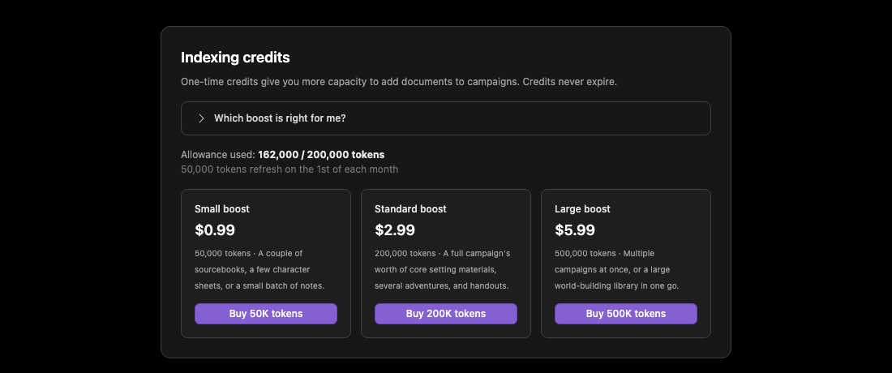
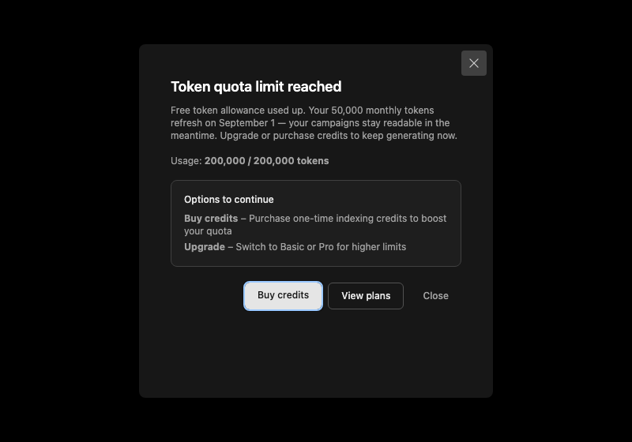

# Limits reference

This document lists all limits, quotas, and constraints in LoreSmith AI. All values are defined in `src/app-constants.ts` unless otherwise noted.

## Processing limits

| Limit | Value | Location | Description |
|-------|-------|----------|-------------|
| `MEMORY_LIMIT_MB` | 128 MB | `PROCESSING_LIMITS` | Cloudflare Workers memory limit. Used for file size checks and error messages. |

Files larger than this cannot be loaded in a single Worker invocation. Large files are processed in chunks.

## One-off credits

Purchased one-off credits add directly to your daily and hourly token limits. If you have 500k credits, your effective limits are base limits + 500k (until credits are depleted).

## Upload and file limits

| Limit | Value | Location | Description |
|-------|-------|----------|-------------|
| `MAX_FILE_SIZE` | 100 MB | `UPLOAD_CONFIG` | Max single-file upload size (kept under `MEMORY_LIMIT_MB`). |
| `MAX_FILES_PER_USER` | 100 | `UPLOAD_CONFIG` | Max files per user across all campaigns. |
| Allowed file types | PDF, text, markdown, DOCX, JSON, images | `UPLOAD_CONFIG.ALLOWED_FILE_TYPES` | MIME types accepted for RAG indexing. |

## Campaign limits

| Limit | Value | Location | Description |
|-------|-------|----------|-------------|
| `MAX_CAMPAIGNS_PER_USER` | 50 | `CAMPAIGN_CONFIG` | Max campaigns per user. |
| `MAX_RESOURCES_PER_CAMPAIGN` | 100 | `CAMPAIGN_CONFIG` | Max resources per campaign. |

## Subscription tiers

**TPH / QPH / TPD / QPD** are computed in `src/config/anthropic-org-rate-budget.ts` from Anthropic org limits (Console) and `expectedConcurrentActiveUsers`, then merged into `SUBSCRIPTION_TIERS` in `src/app-constants.ts`. Other columns are static in `SUBSCRIPTION_TIERS`.

| Tier | Max campaigns | Max files | Storage | TPH / QPH / TPD / QPD | Monthly tokens | Welcome grant | Resources/campaign/hour | Retries/file/day | Retries/file/month |
|------|---------------|-----------|---------|------------------------|----------------|---------------|-------------------------|------------------|--------------------|
| Free | 1 | 5 | 25 MB | Derived (fraction of Basic) | 50k (resets monthly) | 150k (one-time) | 5 | 2 | 6 |
| Basic | 5 | 25 | 1 GB | Derived (org share ÷ concurrent users) | — | — | 20 | 3 | 15 |
| Pro | 999,999 | 100 | 5 GB | Derived (2× Basic rates) | — | — | 50 | 5 | 50 |

- **TPH** = tokens per hour  
- **QPH** = queries per hour  
- **TPD** = tokens per day  
- **QPD** = requests per day  
- **Retries** = indexation/entity extraction retries per file  

### Free tier token allowance

The free tier has **two** token buckets, both defined in `src/app-constants.ts` and combined by `src/lib/free-tier-allowance.ts`:

| Bucket | Constant | Resets | Purpose |
|--------|----------|--------|---------|
| Monthly allowance | `FREE_TIER_MONTHLY_TOKENS` (50k) | 1st of each month | Keeps a campaign warm between sessions — a digest, some planning chat, entity lookups. |
| Welcome grant | `FREE_TIER_WELCOME_GRANT_TOKENS` (150k) | Never | Covers the expensive onboarding burst: indexing a source book, creating a campaign, a first session readout. |

Spend draws from the **monthly allowance first** and overflows into the welcome grant, so the grant is only consumed in months the recurring allowance could not cover. Purchased credits (`user_indexing_credits`) sit on top of both and raise the ceiling without being drawn down.

A free account is blocked from *generating* only when both buckets and any credits are empty, and the block lifts on the 1st. Reads — campaigns, entities, digests, timeline — are never gated by token quota, so a returning GM always finds their world intact.

Usage is tracked in two tables: `user_monthly_usage` (per `year_month`) and `user_free_tier_usage` (cumulative grant draw).

The billing page reports the combined figure, plus when the monthly portion returns:

When every bucket is empty, the block names the refresh date rather than presenting a dead end:

Before issue #746 the free tier was a single one-time 150k bucket that never reset, which left exhausted accounts permanently inert.  

## Authentication

| Limit | Value | Location |
|-------|-------|----------|
| `JWT_EXPIRY_HOURS` | 24 | `AUTH_CONFIG` |
| `SESSION_TIMEOUT_MINUTES` | 60 | `AUTH_CONFIG` |
| `MAX_LOGIN_ATTEMPTS` | 5 | `AUTH_CONFIG` |

## Fallback rate limits

Non-admin users, when tier limits are unavailable (e.g. in usage modals), use `RATE_LIMITS` as fallbacks (matches **Basic** tier derived values):

| Limit | Value |
|-------|-------|
| TPH | Same as Basic `tph` from org budget |
| QPH | Same as Basic `qph` |
| TPD | Same as Basic `tpd` |
| QPD | Same as Basic `qpd` |
| Resources per campaign per hour | 20 |

## Where limits are enforced

- **Memory/file size**: `sync-queue-service`, `rag-service`, `chunked-processing-service`, `pdf-chunking-service`, `file-extraction-service`, `queue-consumer`, `lib/pdf-utils`
- **Rate limits**: `llm-rate-limit-service`
- **Subscription tiers**: `subscription-service`, `library-service`, campaign routes
- **Resource add rate limits**: `resource-add-rate-limit-service`
- **Retry limits**: `retry-limit-service`
