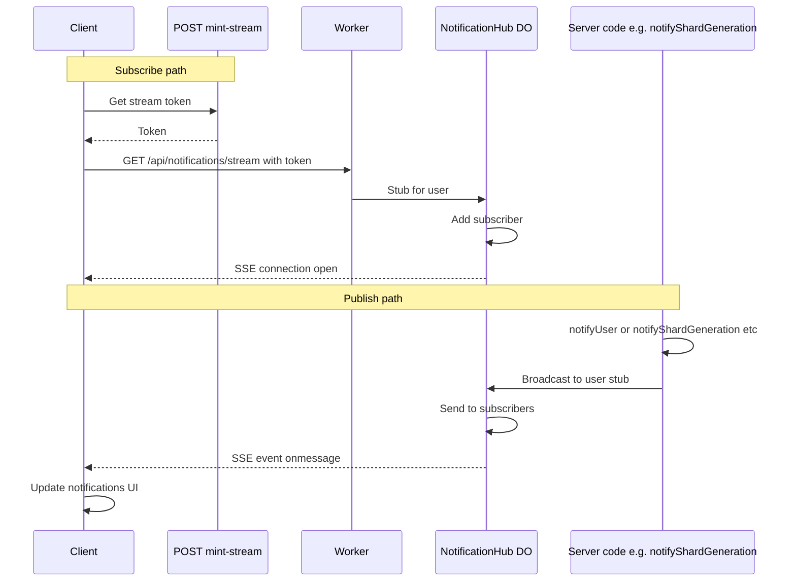

# Real-time Notification System

This document describes the real-time notification system implemented using Server-Sent Events (SSE) with Cloudflare Workers and Durable Objects.

## Architecture

### Components

1. **NotificationHub Durable Object** (`src/durable-objects/notification-hub.ts`)
   - Manages per-user SSE subscribers
   - Broadcasts JSON notifications
   - Handles connection lifecycle and cleanup

2. **SSE Endpoint** (`src/routes/notifications.ts`)
   - `GET /api/notifications/stream` - Establishes SSE connection
   - `POST /api/notifications/publish` - Publishes notifications

3. **Server Helpers** (`src/lib/notifications.ts`)
   - `notifyUser()` - Generic notification function
   - `notifyShardGeneration()` - Shard-specific notifications
   - `notifyFileUploadComplete()` - File upload notifications
   - `notifyCampaignCreated()` - Campaign creation notifications

4. **Client Components**
   - `useNotificationStream()` - React hook for SSE connection
   - `NotificationProvider` - Context provider for notifications
   - `NotificationToast` - UI component for displaying notifications

### SSE flow



## Usage

### Server-side (Publishing Notifications)

```typescript
import { notifyShardGeneration } from "../lib/notifications";

// Send shard generation notification
await notifyShardGeneration(env, userId, campaignName, fileName, shardCount);
```

### Client-side (Receiving Notifications)

```typescript
import { useNotifications } from "@/components/notifications/NotificationProvider";

function MyComponent() {
  const { notifications, isConnected } = useNotifications();

  // Notifications are automatically displayed in the notification bell
  // and available in the notifications array
}
```

## Security

- **Authentication**: Users must be authenticated to establish SSE connections
- **Ownership**: Notifications are scoped to individual users via Durable Object naming
- **No Sensitive Data**: All user-facing messages are clean and human-readable

## Configuration

### Wrangler Configuration

```toml
[[durable_objects.bindings]]
name = "NOTIFICATIONS"
class_name = "NotificationHub"

[[migrations]]
tag = "v7"
new_classes = ["NotificationHub"]
```

### Environment Variables

No additional environment variables required. The system uses existing authentication infrastructure.

## Notification Types

### Shard Generation

- **Type**: `shards_generated`
- **Message**: "🎉 X new shards generated from 'filename'! Check your 'Campaign Name' campaign to review them."

### File Upload

- **Type**: `file_uploaded`
- **Message**: "✅ 'filename' has been uploaded successfully (X MB)"

### Campaign Creation

- **Type**: `campaign_created`
- **Message**: "🎯 Your campaign 'Campaign Name' has been created successfully!"

### Success/Error

- **Type**: `success` | `error`
- **Message**: Custom success or error messages

## Testing

Run the notification system tests:

```bash
npm test tests/notifications/
```

### Test Coverage

- NotificationHub Durable Object functionality
- SSE connection handling
- Notification publishing
- Error handling and cleanup
- Client-side notification display

## Migration from Chat Messages

The system replaces the previous approach of embedding metadata in chat messages:

**Before:**

```
🎉 24 new shards generated from "file.pdf"! Check your campaign to review them. Campaign: 5d79f59a-7528-4517-93ab-4177f518950c
```

**After:**

```
🎉 24 new shards generated from "file.pdf"! Check your "Campaign Name" campaign to review them.
```

## Performance Considerations

- **Connection Limits**: Each user has one SSE connection
- **Memory Usage**: Durable Objects maintain subscriber lists in memory
- **Cleanup**: Automatic cleanup of dead connections via ping/pong
- **Reconnection**: Client-side exponential backoff for reconnection

## Troubleshooting

### Common Issues

1. **Connection Not Established**
   - Check authentication token
   - Verify NotificationHub Durable Object is deployed
   - Check browser console for SSE errors

2. **Notifications Not Received**
   - Verify user authentication
   - Check server logs for notification publishing errors
   - Ensure NotificationProvider is wrapped around the app

3. **Memory Leaks**
   - Durable Objects automatically clean up dead connections
   - Monitor subscriber count via `getSubscriberCount()`

### Debug Logging

Enable debug logging by checking browser console and server logs:

```typescript
// Client-side
console.log("[useNotificationStream] Connected to notification stream");

// Server-side
console.log("[NotificationHub] Broadcasting notification to X subscribers");
```
