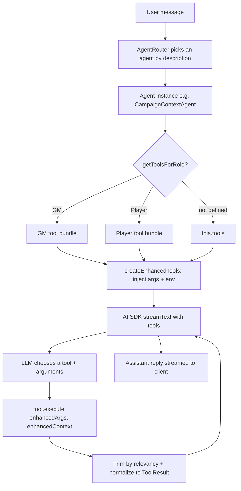

# Tool system

How LoreSmith turns TypeScript functions into AI-callable tools, how those tools reach an agent, and how to add a new one.

This is the **architecture and onboarding** document. For the shared implementation helpers you will use inside `execute` (env-vs-API fallback, auth guards, pagination), see [TOOL_PATTERNS.md](./TOOL_PATTERNS.md). For how requests are routed to an agent in the first place, see [AGENT_DESIGN.md](./AGENT_DESIGN.md).

---

## 1. Overview

A **tool** is a typed function the LLM can decide to call. It is defined with the Vercel AI SDK's `tool()` helper, and the Zod schema you give it becomes the function signature the model sees.

The chain looks like this:

```
Zod schema  →  tool()  →  tool bundle  →  agent  →  AI SDK  →  LLM function calling
```

The codebase currently has ~95 `tool()` definitions across ~75 files in `src/tools/`, grouped into ~20 bundles, consumed by 14 registered agents.



The important thing to internalise: **you never call a tool yourself.** You describe it well enough that the model calls it correctly, and the agent layer fills in the parameters the model must not be trusted with (auth, campaign selection).

---

## 2. Tool anatomy

A minimal tool, matching the codebase convention (`src/tools/common/no-op-tool.ts` is the smallest real example):

```ts
import { type ToolExecutionOptions, tool } from "ai";
import { z } from "zod";
import type { ToolResult } from "@/app-constants";
import { commonSchemas, createToolError, createToolSuccess } from "@/tools/utils";

// 1. Schema declared separately so `z.infer` can type the execute input.
const myToolSchema = z.object({
	campaignId: commonSchemas.campaignId,
	jwt: commonSchemas.jwt,
	title: z.string().describe("Short title the user gave for this thing"),
});

export const myTool = tool({
	// 2. The description is prompt text. The model reads only this + the schema.
	description:
		"Do the thing. Use when the user asks to do the thing. Do NOT use for unrelated requests.",
	inputSchema: myToolSchema,
	execute: async (
		input: z.infer<typeof myToolSchema>,
		options: ToolExecutionOptions<never>
	): Promise<ToolResult> => {
		const toolCallId = options?.toolCallId ?? "unknown";
		try {
			// 3. ...work...
			return createToolSuccess("Did the thing.", { id: "123" }, toolCallId);
		} catch (error) {
			return createToolError("Failed to do the thing.", error, 500, toolCallId);
		}
	},
});
```

### Field-by-field

| Field | Notes |
| --- | --- |
| `description` | **This is prompt engineering, not a code comment.** It is the only thing besides parameter names that tells the model when to call your tool. Existing tools state both when to use it and when *not* to — see `noOpTool` for the fullest example. |
| `inputSchema` | Zod object. Every field should have `.describe()`; those strings go to the model. The AI SDK v5+ name is `inputSchema`, not `parameters` — use `inputSchema` (95 of 95 tools do; the agent's reflection code reads `inputSchema ?? parameters` only for a handful of stragglers). |
| `strict` | Optional, and **rare** — only 5 tools set `strict: true` (`listCampaigns`, `createCampaign`, `updateFileMetadata`, `deleteFile`, `noOpTool` — note that three of those are the confirmation-gated tools). It enables strict JSON-schema function calling so the model cannot invent extra keys. Worth adding for small, closed-parameter, destructive tools; most tools omit it. |
| `execute` | `async (input, options) => ToolResult`. Omitting `execute` makes the tool client-handled — see [§7](#7-confirmation-flow). |

### The result envelope

Tools return a `ToolResult` (`src/shared-config.ts`):

```ts
interface ToolResult {
	toolCallId: string;
	result: { success: boolean; message: string; data?: unknown };
}
```

Build it with `createToolSuccess(message, data, toolCallId)` or `createToolError(message, error, code, toolCallId, campaignId?, campaignName?)` from `src/tools/tool-utils.ts` (re-exported from `src/tools/utils.ts`).

The `message` is user- and model-facing prose; `data` is the structured payload. Passing a `campaignName` appends `for campaign "X"` to the message automatically.

> **Why some tools appear not to follow this:** `BaseAgent` normalizes whatever you return. If the value already has `toolCallId` and `result`, it passes through; otherwise it is wrapped into the envelope, reading `success`/`message`/`data` off the object if present, else treating the whole return as `data` with `success: true`. So a bare return *works* — but always use the helpers, so `toolCallId` correlation and error codes are right.

Tool results are also **trimmed by relevancy** before reaching the model when they exceed ~30% of the model's safe context limit (`trimToolResultsByRelevancy`). Prefer paginated, bounded returns — see the pagination section of [TOOL_PATTERNS.md](./TOOL_PATTERNS.md).

---

## 3. The context object

The second argument to `execute` is the AI SDK's `ToolExecutionOptions`, which `BaseAgent` **extends** before calling your tool. What you actually receive (`base-agent.ts`, `createEnhancedTools`):

| Property | Source | Notes |
| --- | --- | --- |
| `toolCallId` | AI SDK runtime | Always read as `options?.toolCallId ?? "unknown"`. |
| `env` | `this.env` on the agent | Cloudflare Worker/DO bindings: `DB`, `VECTORIZE`, `OPENAI_API_KEY`, R2 buckets, etc. **Absent outside a DO** (e.g. in unit tests) — see below. |
| `sessionId` | `ctx.id.toString()` | The Durable Object session identifier. |
| `playerCharacter` | Resolved claim | `{ username, role, claim, entity }` when the user has claimed a player character, otherwise `null`. |

Note there is **no DAO factory on the context by default** — you derive it from `env`.

### Getting to the database

```ts
import { getEnvFromContext } from "@/tools/utils";
import { getDAOFactory } from "@/dao/dao-factory";

const env = getEnvFromContext(options);   // ToolEnv | null (falls back to globalThis.env)
if (!env) { /* no DB: fall back to the HTTP API, or return an error */ }
const daoFactory = getDAOFactory(env);
```

Or, when the tool is DB-only, use the resolver which does both steps and returns a typed error result:

```ts
import { resolveToolContext } from "@/tools/tool-context";

const resolved = resolveToolContext(options, toolCallId);
if (!resolved.ok) {
	return createToolError(resolved.error.message, resolved.error.detail, resolved.error.code, toolCallId);
}
const { env, daoFactory } = resolved.context;
```

> ### ⚠️ Two different types are both called `ToolContext`
>
> | Type | File | Shape | Meaning |
> | --- | --- | --- | --- |
> | `ToolContext` | `src/tools/utils.ts` | `{ env?: unknown; toolCallId?: string }` | The **loose, incoming** context. What `execute` is handed. |
> | `ToolContext` | `src/tools/tool-context.ts` | `{ env: ToolEnv; daoFactory: DAOFactory }` | The **resolved, guaranteed** context returned by `resolveToolContext`. Designed for dependency injection so tests can pass a mock and bypass env resolution. |
>
> Import the one you mean, explicitly. Prefer typing your `execute` signature as `ToolExecuteOptions` / `ToolExecutionOptions<never>` rather than `any`.

### Auth and access guards

These live in `src/tools/utils.ts` and are **server-side and DAO-backed on purpose** — they cannot be bypassed by the model calling the tool directly:

- `extractUsernameFromJwt(jwt)` — userId, or `""` on failure.
- `requireCampaignAccessForTool({ env, campaignId, jwt, toolCallId })` — returns `{ userId, campaign }` or a `ToolResult` error.
- `requireGMRole(env, campaignId, userId, toolCallId)` — returns `null` when allowed, else a 403 `ToolResult`.
- `requireCanSeeSpoilersForTool({ env, campaignId, jwt, toolCallId })` — GM-only spoiler gate (owner / editor-GM / readonly-GM).

Because these return "error or value" unions, the caller check is `if ("toolCallId" in access) return access;`.

---

## 4. Auto-injected parameters (read this before naming a parameter)

Before each call, `BaseAgent` inspects your Zod `shape` and **overwrites** certain arguments the model produced. This is the least obvious and most consequential part of the system:

| If your schema has… | The agent injects | Behaviour |
| --- | --- | --- |
| `jwt` | The client's JWT | Always overrides the model's value — the LLM frequently invents placeholder tokens. Set to `null` when no client JWT exists. |
| `campaignId` | The user's selected campaign | Overrides the model's value **when a campaign is selected**. With none selected, the model's inferred value is allowed through (so "delete the campaign called X" works). |
| `sessionId` | `ctx.id.toString()` | Filled when absent. `getMessageHistory` has bespoke handling that swaps `sessionId`/`campaignId` based on `historyScope`. |
| `playerCharacterEntityId` | Claimed entity id | Only when the user has claimed a character. |
| `claimedEntityId` | Claimed entity id | Same. |
| `playerCharacterName` | Claimed entity name | Same. |

**Practical consequence:** use `commonSchemas.jwt` and `commonSchemas.campaignId` and the exact names above. A parameter called `campaign_id` or `campaignID` gets no injection and will receive whatever the model guessed.

---

## 5. Tool bundles

Tools are grouped into plain objects — **bundles** — keyed by the name the model sees. An agent is constructed with one bundle.

### File organization

```
src/tools/
├── utils.ts, tool-utils.ts, tool-context.ts   # shared helpers (see §2–3)
├── campaign/            # campaign CRUD, resources, planning   → campaignTools
├── campaign-context/    # entities, search, world state, timeline, encounters, loot, rules, recap
├── character-sheet/     # character sheet upload/creation/list
├── common/              # no-op and support tools
├── file/                # file listing + metadata               → fileTools
├── general/             # recommendations, message history      → generalTools
├── onboarding/          # onboarding guidance and state analysis
└── session-digest/      # session digest generation
```

Naming conventions actually in use:

- `*-tools.ts` — files containing `tool()` definitions.
- `*-tools-bundle.ts` — files that only assemble bundles from other files.
- `*-utils.ts` / `*-helper.ts` — pure logic extracted out of `execute` for testability. **Put real logic here**; the `execute` body should stay thin.
- `index.ts` — the public surface of a directory, and where the legacy `xTools` objects live.

Tool export names are inconsistent by era: older tools are bare verbs (`createCampaign`, `listFiles`), newer ones carry a suffix (`generateHandoutTool`, `recordWorldEventTool`). Match the file you are adding to.

### GM / player pairs

Most bundles ship in two variants — the full set and a sanitized player subset:

```ts
export const campaignContextToolsBundle = { /* ~29 tools */ };

/** Player-facing subset: search, list (sanitized), campaign details, message history */
export const playerCampaignContextToolsBundle = {
	searchCampaignContext, listAllEntities, showCampaignDetails,
	listHouseRulesTool, getMessageHistory,
};
```

The agent selects between them by overriding the optional `getToolsForRole` hook:

```ts
protected getToolsForRole(role: CampaignRole | null): Record<string, any> {
	return isGMRole(role) ? campaignContextToolsBundle : playerCampaignContextToolsBundle;
}
```

When an agent does not define `getToolsForRole`, it uses the single bundle passed to its constructor.

> Role filtering at the bundle level is **defence in depth, not the security boundary.** A GM-only tool must *also* call `requireGMRole` / `requireCanSeeSpoilersForTool` inside `execute`.

Existing bundle pairs follow a `gmXBundle` / `playerXBundle` or `xTools` / `playerXTools` naming pattern (`gmRecapToolsBundle`, `playerCampaignTools`, `characterManagementTools` / `playerCharacterTools`, …).

---

## 6. Registration: from bundle to running agent

1. **Bundle** — export the object from a `*-tools-bundle.ts` or `index.ts`.
2. **Agent** — pass it to `super(...)` and list it in `agentMetadata`:

   ```ts
   export class CampaignContextAgent extends BaseAgent {
     static readonly agentMetadata = {
       type: "campaign-context",
       description: "Answers questions about campaign entities…",  // ← routing prompt
       systemPrompt: CAMPAIGN_CONTEXT_AGENT_SYSTEM_PROMPT,
       tools: campaignContextToolsBundle,
     };
     constructor(ctx: DurableObjectState, env: any, model: any) {
       super(ctx, env, model, campaignContextToolsBundle);
     }
   }
   ```

3. **System prompt** — `buildSystemPrompt({ agentName, responsibilities, tools, workflowGuidelines, importantNotes })` in `src/agents/system-prompts.ts`. Pass `createToolMappingFromObjects(bundle)` as `tools`; it renders one `- "action" → USE toolName tool` line per tool into the prompt. **A tool added to a bundle is described to the model twice** — once by its own `description`, once by this mapping.
4. **Registry** — `src/lib/agent-registry.ts` lazily imports each agent and calls `AgentRouter.registerAgent(type, class, tools, systemPrompt, description)`. The file's header comment is the canonical "how to add an agent" walkthrough.
5. **Routing** — `AgentRouter` selects an agent per message using the registered `description` strings, then `BaseAgent` resolves the role-appropriate bundle and streams.

**Adding a tool to an existing agent requires only step 1 + step 3.** Nothing else needs touching.

---

## 7. Confirmation flow

`src/hooks/useChatSession.ts` holds the list (note: it lives here, **not** in `app.tsx`):

```ts
// List of tools that require human confirmation
const toolsRequiringConfirmation: (
	| keyof typeof generalTools
	| keyof typeof campaignTools
	| keyof typeof fileTools
)[] = ["createCampaign", "updateFileMetadata", "deleteFile"];
```

### What it does today

The hook scans streamed message parts and derives a boolean:

```ts
const pendingToolCallConfirmation = agentMessages.some((m) =>
	m.parts?.some((part) => {
		const info = getToolPartInfo(part);
		return info && isPendingConfirmation(info.state)
			&& toolsRequiringConfirmation.includes(info.toolName);
	})
);
```

`isPendingConfirmation` is true for state `"call"` / `"input-available"` — i.e. the model has produced arguments but no output exists yet. `getToolPartInfo` normalizes both the legacy `tool-invocation` shape and the newer typed `tool-{name}` stream parts (`src/lib/tool-part-utils.ts`).

The boolean flows through `AppShellContext` → `AppShell` → `ChatArea`, where it **disables the chat input and send button** and swaps the placeholder to "Please respond to the tool confirmation above…".

> ### Current limitation — please read before extending
>
> All three listed tools define an `execute`, so the server runs them automatically; the pending state is transient and there is no Approve/Reject UI and no `addToolResult` call anywhere in the client. In practice the list today **only gates chat input while those tools are mid-flight** — it does not actually block execution.
>
> To implement true human-in-the-loop confirmation for a tool, the AI SDK pattern is to **omit `execute` from the tool definition** so the SDK suspends the call, render approve/reject controls for the pending part, and resolve it client-side with `addToolResult` (dispatching to the matching entry in the `executions` map). The `executions` object in `src/tools/index.ts` and the "this should match the keys in the executions object" comment are the remains of that pattern.

### Adding a tool to the list

Add its exported key to `toolsRequiringConfirmation`. The union type means the tool must be reachable from `generalTools`, `campaignTools`, or `fileTools`; a tool that lives only in, say, `campaignContextToolsBundle` will not type-check without widening that union.

Reserve confirmation for **destructive or externally-visible** actions — deletes, spend, sharing, publishing.

---

## 8. How to add a new tool

### Step 1 — Pick the directory

Put it next to its domain (`campaign-context/` for entity/world data, `file/` for file operations, …). Add to an existing `*-tools.ts` file rather than creating a new one, unless the tool is substantial.

### Step 2 — Define the schema

```ts
const archiveEntitySchema = z.object({
	campaignId: commonSchemas.campaignId,   // ← auto-injected, use the exact name
	jwt: commonSchemas.jwt,                 // ← auto-injected
	entityId: z.string().describe("The entity id returned by searchCampaignContext"),
	reason: z.string().optional().describe("Why the entity is being archived"),
});
```

`.describe()` every field. Point the model at where a value comes from ("the entity id returned by searchCampaignContext") — this measurably reduces hallucinated ids.

### Step 3 — Write the tool

`archiveEntityTool` below is illustrative — `entityDAO.archiveEntity` does not exist today. Copy the *shape*, not the DAO call.

```ts
export const archiveEntityTool = tool({
	description:
		"Archive a campaign entity so it stops appearing in search results. " +
		"Use when the user asks to archive, retire, or hide an entity. " +
		"Do NOT use to permanently delete — use deleteEntityTool for that.",
	inputSchema: archiveEntitySchema,
	execute: async (
		input: z.infer<typeof archiveEntitySchema>,
		options: ToolExecuteOptions
	): Promise<ToolResult> => {
		const { campaignId, jwt, entityId, reason } = input;
		const toolCallId = options?.toolCallId ?? "unknown";

		const env = getEnvFromContext(options);
		if (!env) {
			return createToolError("Environment not available", "Direct database access is required.", 500, toolCallId);
		}

		// Access control — required, not optional.
		const access = await requireCampaignAccessForTool({ env, campaignId, jwt, toolCallId });
		if ("toolCallId" in access) return access;   // it's a ToolResult error
		const { userId } = access;

		const gmError = await requireGMRole(env, campaignId, userId, toolCallId);
		if (gmError) return gmError;

		try {
			const daoFactory = getDAOFactory(env);
			await daoFactory.entityDAO.archiveEntity(entityId, reason ?? null);
			return createToolSuccess(`Archived the entity.`, { entityId }, toolCallId);
		} catch (error) {
			return createToolError("Failed to archive entity.", error, 500, toolCallId);
		}
	},
});
```

Checklist for `execute`:

- [ ] `toolCallId` read from options with an `"unknown"` fallback.
- [ ] `env` resolved via `getEnvFromContext` / `resolveToolContext`.
- [ ] Access checked with `requireCampaignAccessForTool` (+ `requireGMRole` / `requireCanSeeSpoilersForTool` if GM-only).
- [ ] Whole body wrapped in `try/catch` returning `createToolError`.
- [ ] Bounded output — paginate rather than returning unbounded lists.
- [ ] Non-trivial logic extracted to a `*-utils.ts` sibling.

### Step 4 — Add it to a bundle

```ts
// src/tools/campaign-context/context-tools-bundle.ts
export const campaignContextToolsBundle = {
	/* … */
	archiveEntityTool,
};
```

If the tool is GM-only, add it to the GM bundle **only** — and keep the in-`execute` role guard anyway.

### Step 5 — Teach the agent when to use it

Add a line to the owning agent's `responsibilities` and, if there's a sequencing rule, to `workflowGuidelines`:

```ts
"Entity lifecycle: archive entities with archiveEntityTool when the user asks to retire or hide them.",
```

### Step 6 — Confirmation (only if destructive)

Add the export name to `toolsRequiringConfirmation` in `src/hooks/useChatSession.ts`, subject to the union-type constraint in [§7](#7-confirmation-flow).

### Step 7 — Test

Tests live in `tests/tools/`, one file per tool module, run with Vitest. The established pattern mocks the DAO factory at the module boundary:

```ts
import { beforeEach, describe, expect, it, vi } from "vitest";

const mockDaoFactory = {
	campaignDAO: { getCampaignByIdWithMapping: vi.fn(), getCampaignRole: vi.fn() },
	entityDAO: { archiveEntity: vi.fn() },
};
vi.mock("@/dao/dao-factory", () => ({ getDAOFactory: vi.fn(() => mockDaoFactory) }));

import { archiveEntityTool } from "@/tools/campaign-context/entity-tools";

it("returns 403 for a player role", async () => {
	mockDaoFactory.campaignDAO.getCampaignByIdWithMapping.mockResolvedValue({ campaignId: "c1", name: "C" });
	mockDaoFactory.campaignDAO.getCampaignRole.mockResolvedValue("player");

	const result = await archiveEntityTool.execute!(
		{ campaignId: "c1", jwt: validJwt, entityId: "e1" },
		{ toolCallId: "t1", env: { DB: {} } } as any
	);

	expect(result.result.success).toBe(false);
});
```

Note the `vi.mock` calls are hoisted above the tool import — that ordering is deliberate and load-bearing. Cover at minimum: the happy path, the missing-env path, and each access-control rejection.

---

## 9. Quick reference

| I want to… | Go to |
| --- | --- |
| Define a tool | `tool({ description, inputSchema, execute })` |
| Return a result | `createToolSuccess` / `createToolError` — `src/tools/tool-utils.ts` |
| Reach the DB | `getEnvFromContext(options)` → `getDAOFactory(env)`, or `resolveToolContext` |
| Support both DO and API paths | `runWithEnvOrApi` — see [TOOL_PATTERNS.md](./TOOL_PATTERNS.md) |
| Get the caller | `extractUsernameFromJwt(jwt)` |
| Guard a campaign | `requireCampaignAccessForTool` |
| Guard GM-only work | `requireGMRole`, `requireCanSeeSpoilersForTool` |
| Reuse a param schema | `commonSchemas.campaignId` / `.jwt` / `.username` |
| Add to an agent | bundle object + `responsibilities` line |
| Register a new agent | `src/lib/agent-registry.ts` (see its header comment) |
| Require confirmation | `toolsRequiringConfirmation` — `src/hooks/useChatSession.ts` |

---

## See also

- [TOOL_PATTERNS.md](./TOOL_PATTERNS.md) — env-vs-API execution paths, response helpers, pagination, encounter builder tool contracts
- [AGENT_DESIGN.md](./AGENT_DESIGN.md) — agent routing, `BaseAgent` behavior, token handling
- [DAO_LAYER.md](./DAO_LAYER.md) — the DAO factory tools call into
- [TESTING_GUIDE.md](./TESTING_GUIDE.md) — test layout and commands
- [CONTRIBUTING.md](./CONTRIBUTING.md) — contribution workflow
