# LoreSmith AI User Guide

Welcome to LoreSmith AI! This guide will help you get started with campaign planning and resource management.

## Table of Contents

1. [Getting Started](#getting-started)
2. [Authentication](#authentication)
3. [Your First Campaign](#your-first-campaign)
4. [Building Your Resource Library](#building-your-resource-library)
5. [Using the AI Assistant](#using-the-ai-assistant)
6. [Session Planning](#session-planning)
7. [Tips and Best Practices](#tips-and-best-practices)

## Getting Started

### First Steps

When you first access LoreSmith AI, you'll see the welcome screen with three main paths to begin your campaign journey:

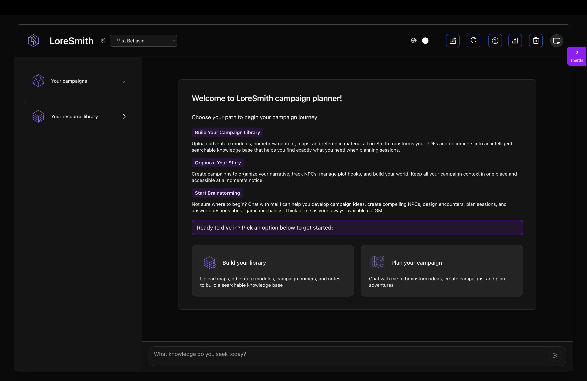

The welcome screen presents you with clear options:

1. **Build Your Campaign Library** - Upload resources to create your knowledge base
2. **Organize Your Story** - Create campaigns to structure your narrative
3. **Start Brainstorming** - Begin chatting with the AI assistant

### What You Need

- An OpenAI API key ([Get one here](https://platform.openai.com/api-keys))
- Access to a LoreSmith AI instance
- Campaign resources (PDFs, documents, images) you want to organize

### First Login

1. Navigate to your LoreSmith instance
2. Enter a username (this can be anything you prefer)
3. If required, enter the admin key
4. Enter your OpenAI API key
5. Click "Sign In"

Your session will remain active for 24 hours. After that, you'll need to sign in again.

## Authentication

### Understanding Authentication

LoreSmith uses a secure authentication system where:

- **Username**: Your personal identifier (can be any name you choose)
- **Admin Key**: Optional access key (if your instance requires it)
- **OpenAI API Key**: Your personal OpenAI API key for AI features

**Important**: Your OpenAI API key is:

- Stored securely in your session
- Never shared with other users
- Automatically cleared when your session expires
- Used only for your AI interactions

### Admin Access

If you authenticate with an admin key, you'll have access to additional administrative features:

- **Admin Dashboard**: View GraphRAG statistics and system telemetry
- **System Metrics**: Monitor query performance, rebuild metrics, and system health
- **Usage Analytics**: Track changelog growth, user satisfaction, and context accuracy

The admin dashboard is accessible via the 📊 icon in the top header bar (visible only to admin users).

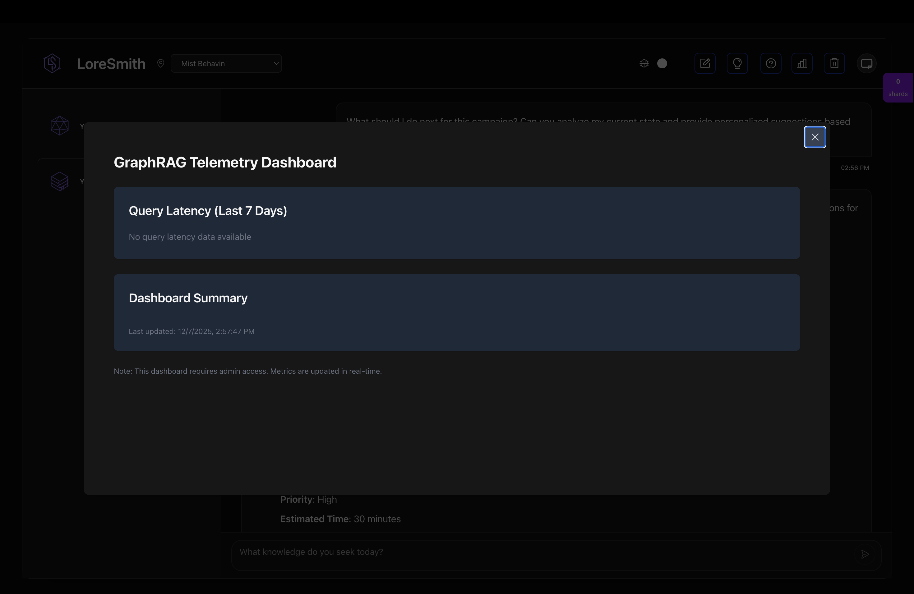

### Session Management

- Sessions last 24 hours
- You can use multiple devices with the same credentials
- Logging out clears your session on that device

## Your First Campaign

### Creating a Campaign

To create your first campaign, click the **"Create Campaign"** button in the sidebar. This opens the campaign creation modal:

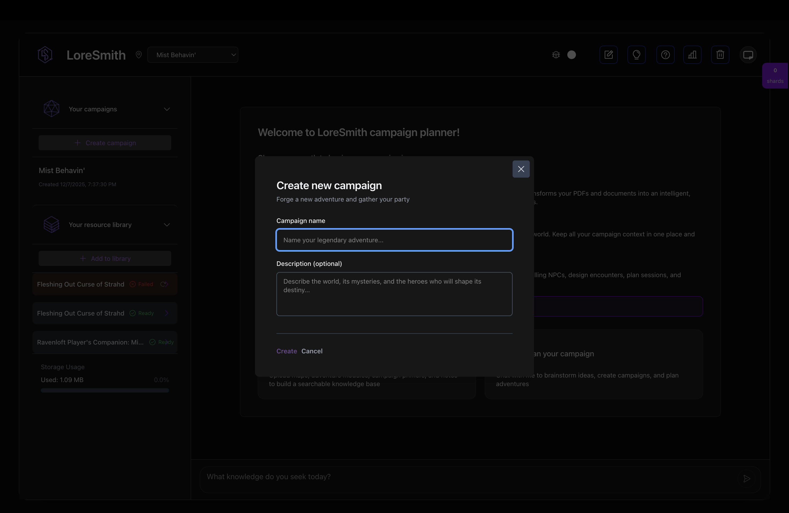

The modal allows you to:

1. **Enter Campaign Name**: Give your campaign a memorable name (e.g., "The Dragon's Hoard")
2. **Add Description** (optional): Provide context about your campaign's world, setting, or premise
3. **Create**: Click "Create" to finalize your campaign, or "Cancel" to discard

Once created, your campaign will appear in the sidebar and you can start adding resources and planning sessions.

**Tip**: You can also ask the AI assistant to help you create a campaign. The assistant can guide you through the process and provide suggestions based on your preferences. Make sure to select your campaign from the dropdown in the top left after creation to ensure the AI uses the correct context for future conversations.

### Campaign Features

Once you have a campaign:

- **Resource Library**: Upload and organize campaign files
- **AI Context**: The AI assistant understands your campaign's context
- **Session Tracking**: Keep track of sessions and world state
- **Entity Graph**: Automatically track NPCs, locations, and relationships

### Multiple Campaigns

You can create as many campaigns as you need:

- Each campaign maintains its own context
- Resources can be added to multiple campaigns
- Switch between campaigns using the sidebar

## Building Your Resource Library

### Uploading Files

To add resources to your library, click **"Add to Library"** in the sidebar. This opens the upload modal:

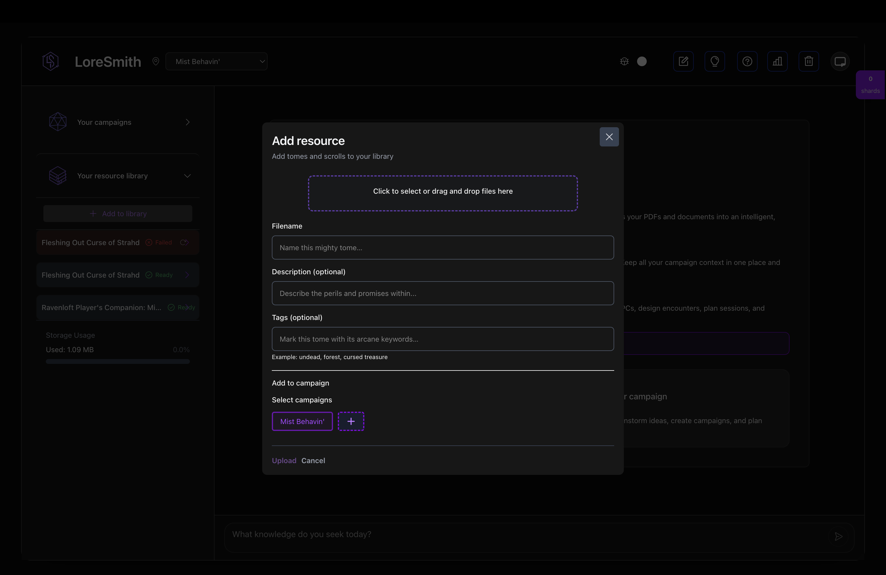

The upload modal allows you to:

1. **Select Files**: Click to select or drag and drop files into the upload area
2. **Add Metadata** (optional):
   - **Filename**: Give your resource a custom name
   - **Description**: Add notes about the resource's content
   - **Tags**: Add keywords for better organization (e.g., "undead, forest, cursed treasure")
3. **Add to Campaigns** (optional): Select which campaigns this resource should be associated with
4. **Upload**: Click "Upload" to start processing

**Supported formats:**

- PDF files (up to 100MB - Cloudflare Workers memory limit with buffer)
- Images (PNG, JPG, etc.)
- Text documents

After clicking "Upload", wait for processing to complete. You'll see the file appear in your resource library once it's ready.

### File Processing

After upload, LoreSmith automatically:

- Extracts text content from PDFs
- Identifies entities (NPCs, locations, items)
- Creates searchable indexes
- Builds relationships between entities
- **Generates AI-powered metadata** including descriptions and tags based on the file's content

### AI-Generated Metadata

When a file is processed, LoreSmith uses AI to automatically generate:

- **Descriptions**: Intelligent summaries of the file's content and purpose
- **Tags**: Relevant keywords and categories extracted from the content

You can view the AI-generated metadata by clicking on a file in your resource library:

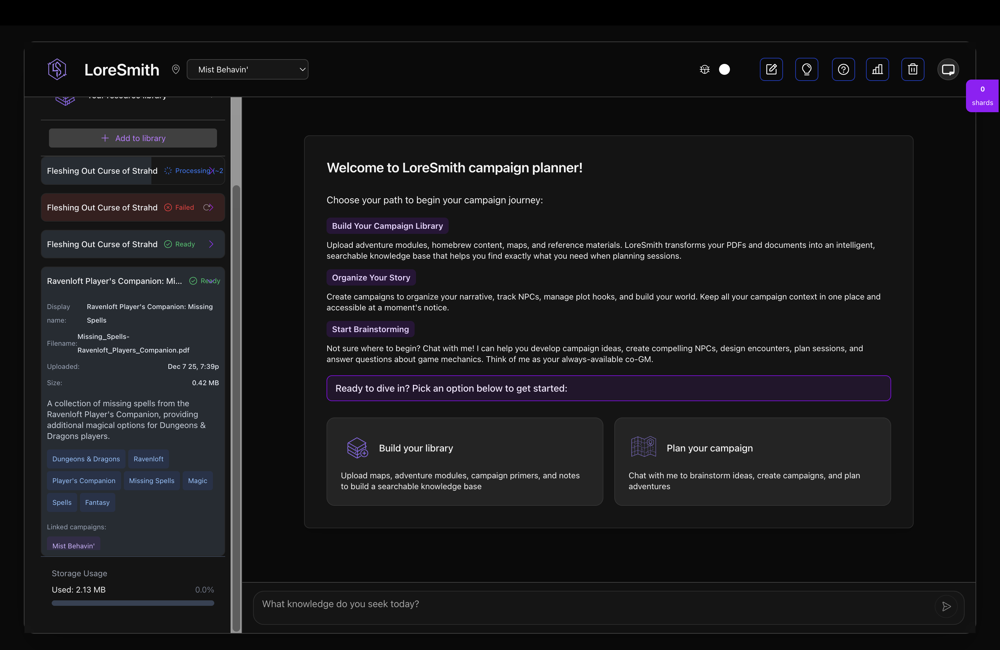

The metadata can be edited at any time using the "Edit" button if you want to customize or refine the AI-generated content.

### Processing Status

Files in your resource library show their processing status:

- **Ready** (green) - File has been successfully processed and is searchable

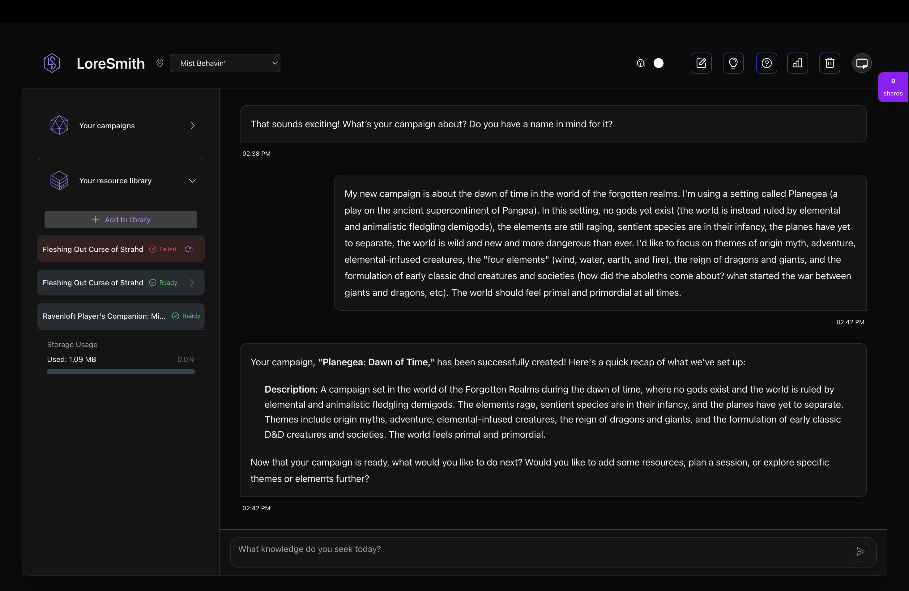

- **Processing** - File is currently being analyzed and indexed

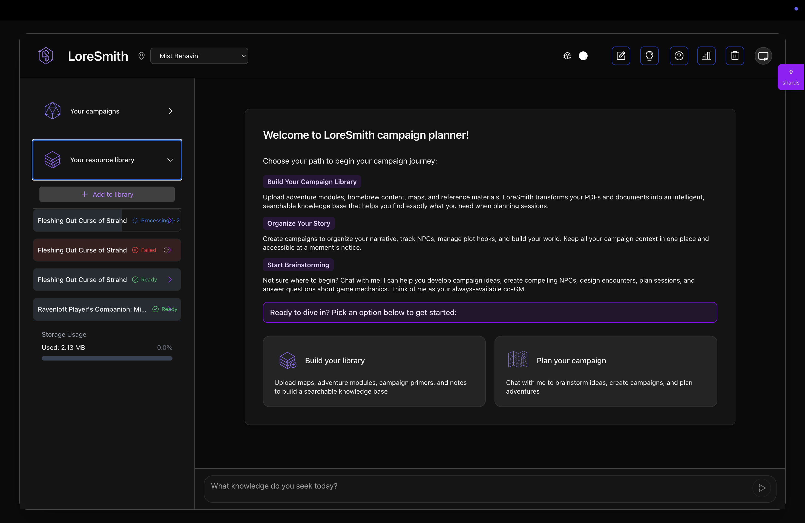

- **Failed** (red) - Processing encountered an error

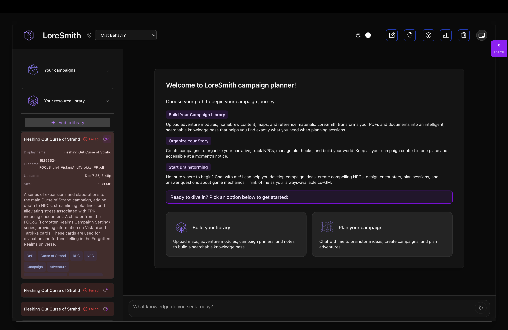

If a file shows a "Failed" status, you can:

1. Click the retry button to attempt processing again
2. Check the file format - ensure it's a supported type
3. Verify the file isn't corrupted
4. Try uploading the file again if retry doesn't work

### Processing Status

Files in your resource library show their processing status:

- **Ready** (green) - File has been successfully processed and is searchable


- **Processing** - File is currently being analyzed and indexed


- **Failed** (red) - Processing encountered an error


If a file shows a "Failed" status, you can:

1. Click the retry button to attempt processing again
2. Check the file format - ensure it's a supported type
3. Verify the file isn't corrupted
4. Try uploading the file again if retry doesn't work

### Adding Files to Campaigns

1. Find the file in your library
2. Click the file to view details
3. Click the **"Add to Campaign"** button
4. Select which campaign(s) to add the file to from the dropdown menu

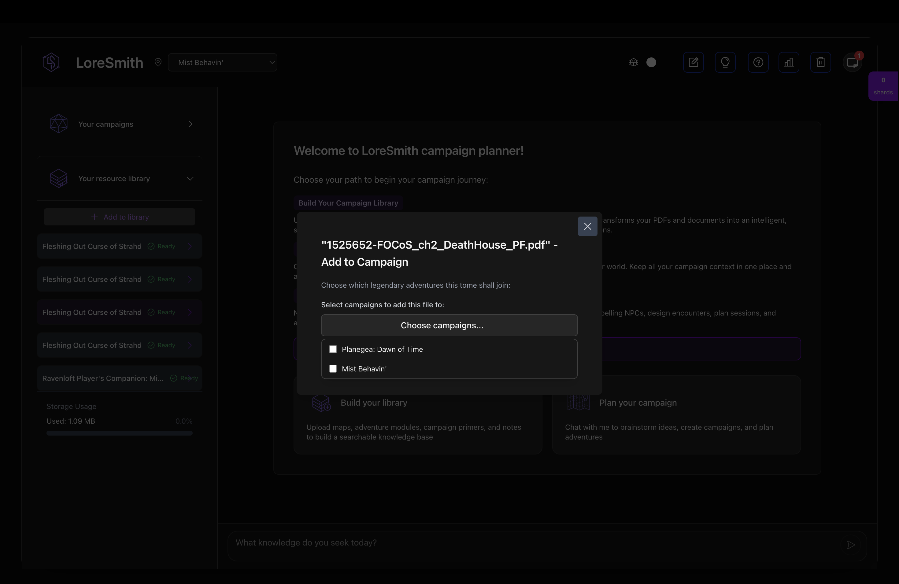

5. Click **"Add to Campaigns"** to confirm
6. The file's content will become part of the campaign's knowledge base and be available for AI queries

You can add the same file to multiple campaigns if it's relevant to several of your adventures.

### Reviewing and Approving Shards

After adding a file to a campaign, LoreSmith automatically extracts entities (NPCs, locations, items, etc.) as "shards" that you can review before they're added to your campaign's knowledge base.

**To review shards:**

1. When shards are generated, you'll receive a notification
2. The **Pending Shards** panel will appear on the right side of the interface (or click the shard badge if it's minimized)
3. Review each shard, which shows:
   - **Entity Type**: NPC, Location, Item, etc.
   - **Name and Details**: The extracted information
   - **Confidence Score**: How confident the AI is in the extraction
   - **Properties**: Number of properties extracted
   - **Tags**: Relevant tags for the entity

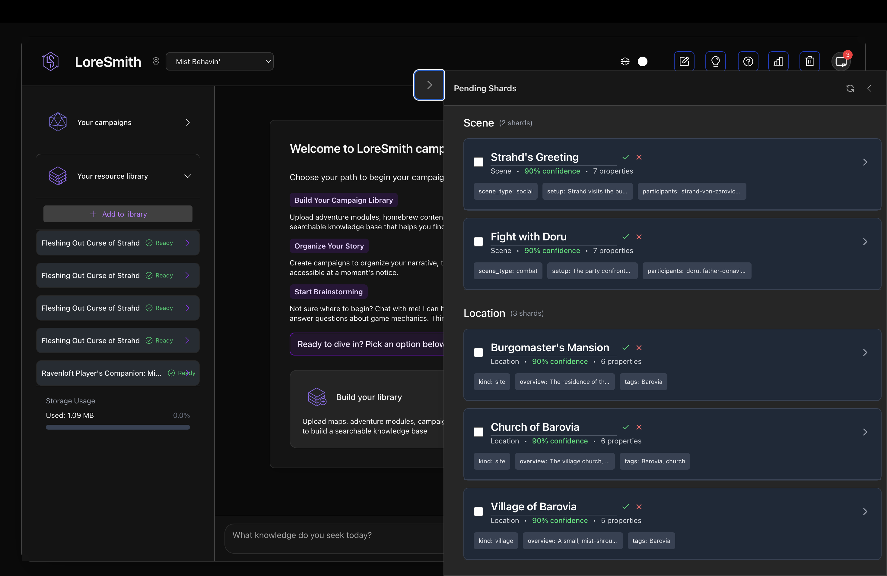

4. For each shard, you can:
   - **Approve** (✓): Accept the shard and add it to your campaign
   - **Reject** (✗): Mark it as incorrect or not relevant
   - **View Details**: Click the arrow to see full information

5. You can select multiple shards and approve or reject them in bulk using the checkboxes

### Editing Shard Details

When viewing shard details, you have full control over the entity's metadata and importance:

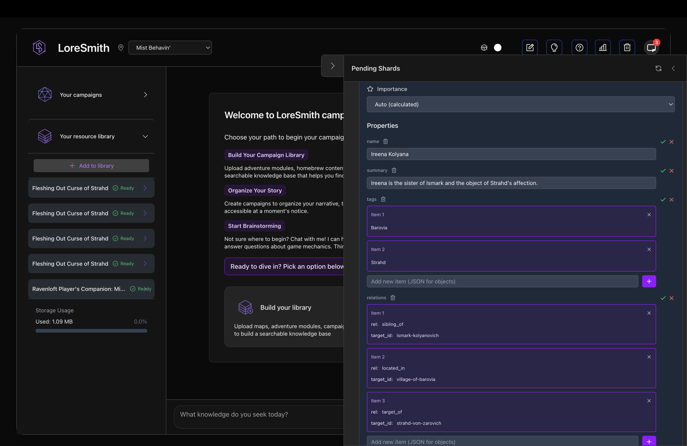

**Adjusting Importance:**

- Each shard has an **importance** value that affects how much weight it carries in campaign consequences
- As the Game Master, you can modify this importance to reflect the entity's role in your world
- Higher importance means the entity will have more influence on AI-generated suggestions and story consequences
- The system auto-calculates importance, but you can override it to match your campaign's narrative priorities

**Editing Metadata:**

- All detected properties are **fully editable**: name, role, summary, tags, and more
- You can add, remove, or modify any field to better match your campaign's needs
- Tags can be added or removed to improve organization and searchability
- Changes are saved when you approve the shard

**Entity Relationships:**

- The AI automatically detects **relationships** between entities (e.g., "allied_with", "enemy_of", "located_in")
- These relationships help the AI understand how entities interact in your campaign world
- You can add, remove, or modify relationships to reflect your campaign's unique connections
- Relationship metadata shows how entities relate to others (e.g., "Arrigal is allied with Strahd")

**Why review shards?**

- Only approved shards are used in AI queries for your campaign
- Rejected shards are permanently excluded from search results
- This ensures your campaign AI has accurate, relevant information
- Editing importance and metadata allows you to customize how the AI prioritizes and uses entities in your world

**Notification Workflow:**

- You'll receive a notification when shards are generated ("New Shards Ready!")
- After reviewing and approving shards, you'll receive a confirmation notification ("Shards Approved!")
- These notifications help you track the complete workflow from file upload to shard approval


### Organizing Resources

- **Tags**: Add tags to files for better organization
- **Descriptions**: Add notes and descriptions to files
- **Search**: Use the search bar to find files quickly
- **Filtering**: Filter by campaign, tags, or file type

## Notifications

LoreSmith provides real-time notifications to keep you informed about important events and system updates.

### Notification Types

You'll receive notifications for:

- **File Status Updates**: When files are uploaded, processing, or completed
- **Shard Generation**: When shards are created from files added to campaigns


- **Shard Approval**: When you approve or reject shards, you'll receive notifications confirming the action


The notification panel tracks the complete shard workflow:

- **"File Added to Campaign"**: Confirms a file was successfully added
- **"New Shards Ready!"**: Notifies when shards are generated and ready for review
- **"Shards Approved!"**: Confirms when shards have been approved and added to your campaign's knowledge base

- **Campaign Events**: When files are added to campaigns, shards are generated, etc.
- **System Updates**: Important system status changes

When shards are generated, you'll receive a notification with details about how many shards were created and which campaign they're for. These shards are available for review in the Shard Management panel.

### Viewing Notifications

Notifications appear in the notifications panel (bell icon) in the top right corner of the application:

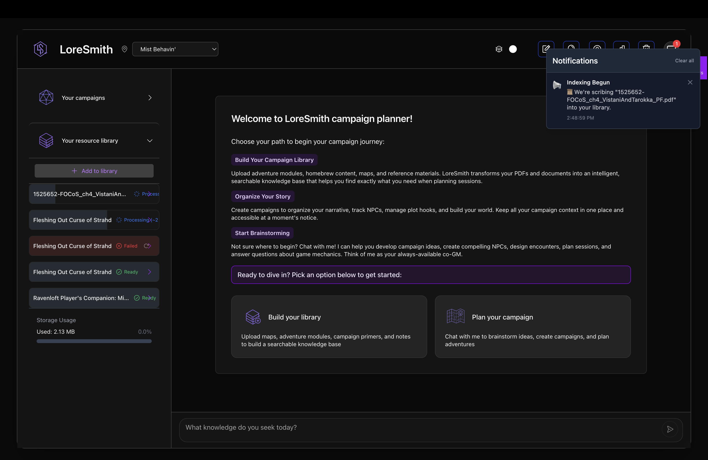

The notification panel shows:

- **Notification Title**: What the notification is about
- **Notification Message**: Detailed information about the event
- **Timestamp**: When the notification occurred
- **Dismiss Option**: Click the "X" to dismiss individual notifications

You can also use the **"Clear all"** button to dismiss all notifications at once.

## Using the AI Assistant

### Getting Help

If you're not sure where to start, click the **"Get help"** button in the top right corner. This will start a conversation with the AI assistant that provides personalized guidance based on your current state:

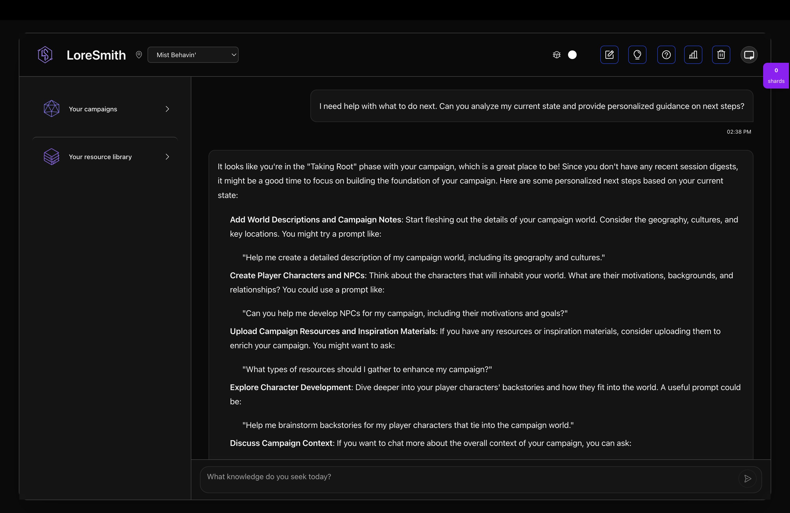

The AI will analyze what you have set up and provide actionable next steps, such as:

- Uploading your first resource
- Creating your first campaign
- Planning sessions
- Organizing your campaign context

### Campaign Assessment and Next Steps

Use the **"What should I do next?"** button to get personalized campaign assessment and suggestions from the AI. This feature analyzes your campaign's current state and provides actionable recommendations:

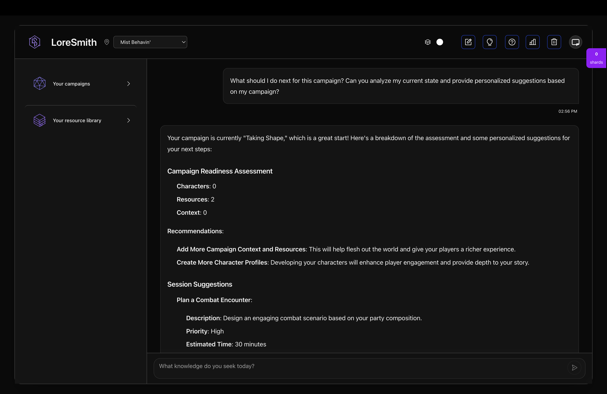

The AI will assess:

- **Campaign Development**: How well-developed your campaign is across different dimensions
- **Content Gaps**: Areas that need more detail or context
- **Priority Actions**: What you should focus on next to strengthen your campaign
- **Specific Suggestions**: Detailed recommendations for NPCs, locations, plot hooks, and more

This helps you:

- Identify what needs more development in your campaign
- Get specific, actionable suggestions tailored to your campaign's current state
- Understand which areas are strong and which need attention
- Track your campaign's progression and growth over time

### Starting a Conversation

The AI assistant is available in the main chat area. You can ask it to:

- **Plan Sessions**: "What should I prepare for next session?"
- **Find Information**: "What do we know about the Black Dragon?"
- **Create Content**: "Generate NPCs for the tavern scene"
- **Answer Questions**: "How should I handle player conflict?"
- **Get Guidance**: Click "Get help" for personalized assistance

### Campaign Selection and AI Context

The campaign dropdown in the top left corner is crucial for AI responses. When you select a campaign, the AI assistant automatically:

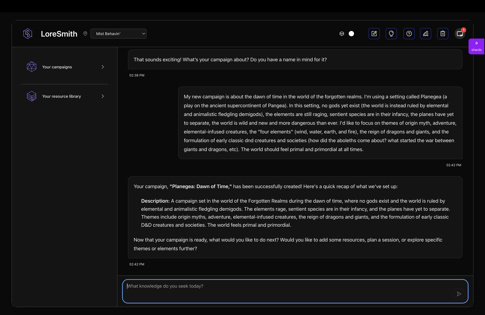

- Accesses your campaign's resource library
- Understands entity relationships
- References past sessions
- Maintains world state continuity
- Provides campaign-specific guidance

**Important**: Always select your campaign from the dropdown before asking campaign-specific questions. The AI uses the selected campaign to provide contextually relevant responses.

You can also ask the AI to help you create campaigns. The assistant can guide you through the process and suggest campaign ideas based on your needs.

### Best Practices for AI Queries

- **Be Specific**: "What happened in session 3?" is better than "Tell me about sessions"
- **Provide Context**: Mention relevant NPCs, locations, or events
- **Ask Follow-ups**: Build on previous answers for deeper planning
- **Use Natural Language**: Talk to it like a co-GM

### Example Conversations

**Session Planning:**

```
You: "I want to run a session focused on exploring the ancient ruins.
     What NPCs and locations from my resources are relevant?"

AI: [Provides relevant entities, relationships, and context from your resources]
```

**World Building:**

```
You: "Create a merchant NPC who could sell information about the ruins"

AI: [Generates NPC with backstory, motivations, and integration suggestions]
```

**Campaign Continuity:**

```
You: "What major events have happened in the campaign so far?"

AI: [Summarizes session digests and world state changes]
```

## Session Planning

### Creating Session Digests

Session digests allow you to record what happened in each session and update your campaign's world state. The AI uses these digests to maintain continuity and provide context-aware planning assistance.

**To access session digests:**

1. Select your campaign from the dropdown in the top left
2. Click on the campaign name in the sidebar to open the **Campaign Details** modal
3. Navigate to the **"Session Digests"** tab

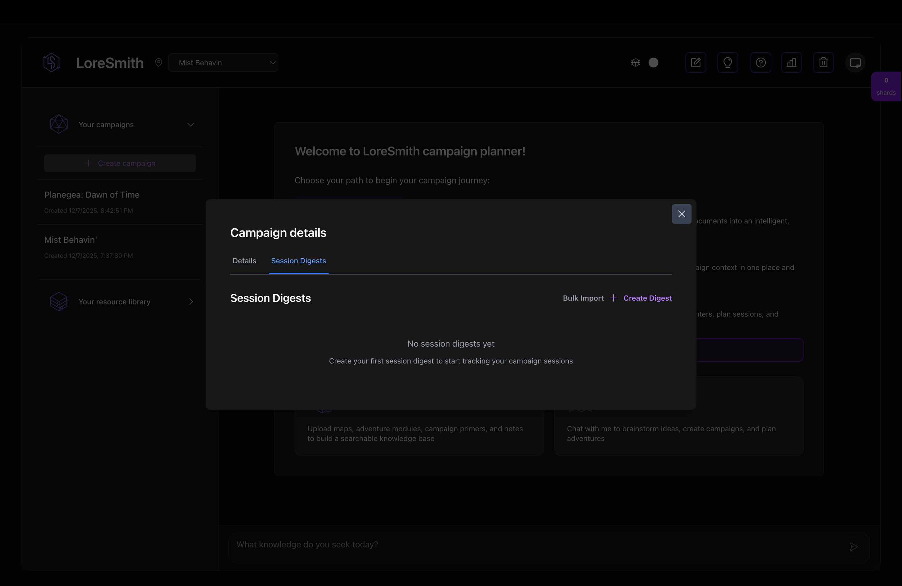

**To create a session digest:**

You can create session digests in two ways:

**Option 1: Using the Campaign Details Modal**

1. Click **"+ Create Digest"** button in the Campaign Details modal
2. Fill in the session information

**Option 2: Using the AI Assistant (Recommended)**

1. Simply ask the AI: **"I want to record a session recap"** or **"Help me create a session digest"**
2. The AI will guide you through the process step-by-step

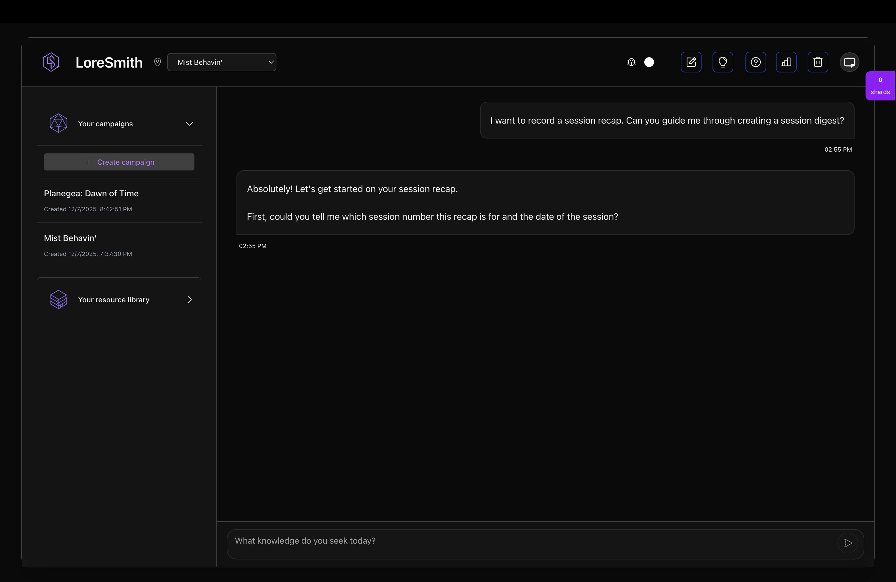

The AI will ask you for:

- Session number and date
- Key events and plot developments
- NPC interactions and relationship changes
- Location discoveries or changes
- Player decisions and their consequences
- World state updates

The AI helps format and organize the digest, ensuring all important information is captured and properly structured for future reference.

**Bulk Import:**

You can also use the **"Bulk Import"** option to import multiple session recaps at once, useful if you're migrating from another system or catching up on past sessions.

### Tracking World State

Session digests automatically track and update your campaign's world state:

- **NPC Changes**: Status updates, relationships, motivations
- **Location Updates**: New discoveries, changes to places
- **Plot Development**: Story beats, revelations, conflicts
- **Player Actions**: Significant decisions and consequences

**How it works:**

When you add a session digest, LoreSmith automatically:

- Extracts entities (NPCs, locations, items) mentioned in the digest
- Updates world state based on the events you describe
- Links session events to existing campaign entities
- Makes this information available to the AI for future session planning

This creates a living record of your campaign that grows with each session, ensuring the AI always has the most current understanding of your world.

### Using Session History

When planning future sessions:

- The AI can reference past sessions
- World state is maintained automatically
- Continuity is preserved across sessions
- Recent sessions are prioritized in search

### Session Planning Workflow

1. **Review Past Sessions**: Ask the AI about recent events
2. **Check Resources**: Search your library for relevant content
3. **Plan Encounters**: Generate NPCs, locations, and events
4. **Create Outline**: Get an AI-generated session outline
5. **Run Session**: Play your planned session
6. **Record Digest**: Document what happened
7. **Repeat**: Use the new context for next session planning

## Tips and Best Practices

### Organizing Your Library

- **Use Descriptive Names**: Name files clearly (e.g., "DragonLair_Map.pdf" not "map1.pdf")
- **Add Tags**: Create tags for themes, locations, or NPCs
- **Write Descriptions**: Helpful notes make files easier to find later
- **Group by Campaign**: Add relevant files to each campaign

### Working with Campaigns

- **One Campaign per Story**: Keep separate campaigns for different stories
- **Share Resources**: Add resources to multiple campaigns if they're relevant
- **Regular Updates**: Keep session digests up to date
- **Review Regularly**: Check campaign context to maintain continuity

### Getting the Most from AI

- **Provide Context**: The more context you give, the better the responses
- **Be Iterative**: Build on AI suggestions with follow-up questions
- **Use Specific Queries**: Detailed questions get better answers
- **Review and Refine**: AI suggestions are starting points - customize them

### Performance Tips

- **Large Files**: Processing large PDFs may take time - be patient
- **Many Resources**: The system handles large libraries, but organization helps
- **Complex Queries**: Some complex queries may take a few seconds
- **Caching**: Recent queries are cached for faster responses

### Troubleshooting

**AI Not Responding:**

- Check your OpenAI API key is valid
- Ensure you have API credits available
- Try refreshing the page

**Files Not Processing:**

If you see a file with a "Failed" status in your resource library:


- Click the retry button (🔄) next to the failed file to attempt processing again
- Check that the file format is supported (PDF, images, text documents)
- Verify the file isn't corrupted - try opening it locally first
- Check file size (max 100MB - Cloudflare Workers memory limit with buffer)
- Wait a few minutes and refresh, then retry if needed

**Missing Context:**

- Ensure resources are added to campaigns
- Check that session digests are created
- Verify entities were extracted from files

## Advanced Features

### Entity Graph Exploration

The system automatically builds a knowledge graph of your campaign:

- **Entities**: NPCs, locations, items, organizations
- **Relationships**: Connections between entities
- **Context**: Rich context from your resources

### Semantic Search

Search works by meaning, not just keywords:

- Find related concepts even with different wording
- Discover connections between entities
- Get contextually relevant results

### GraphRAG Technology

LoreSmith uses GraphRAG (Graph Retrieval Augmented Generation):

- Combines knowledge graphs with AI generation
- Maintains entity relationships
- Provides contextually aware responses

## Getting Help

- **In-App Help**: Click the help button (?) in the interface
- **Documentation**: Check the docs folder for detailed guides
- **Support**: Contact your instance administrator for issues

---

**Happy Campaign Planning!** 🎲✨
