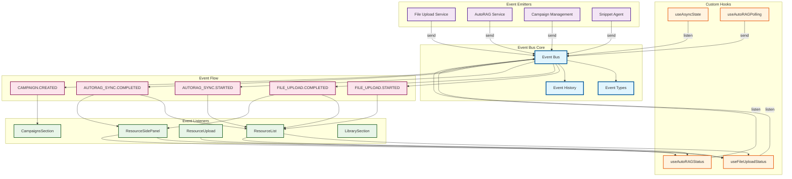
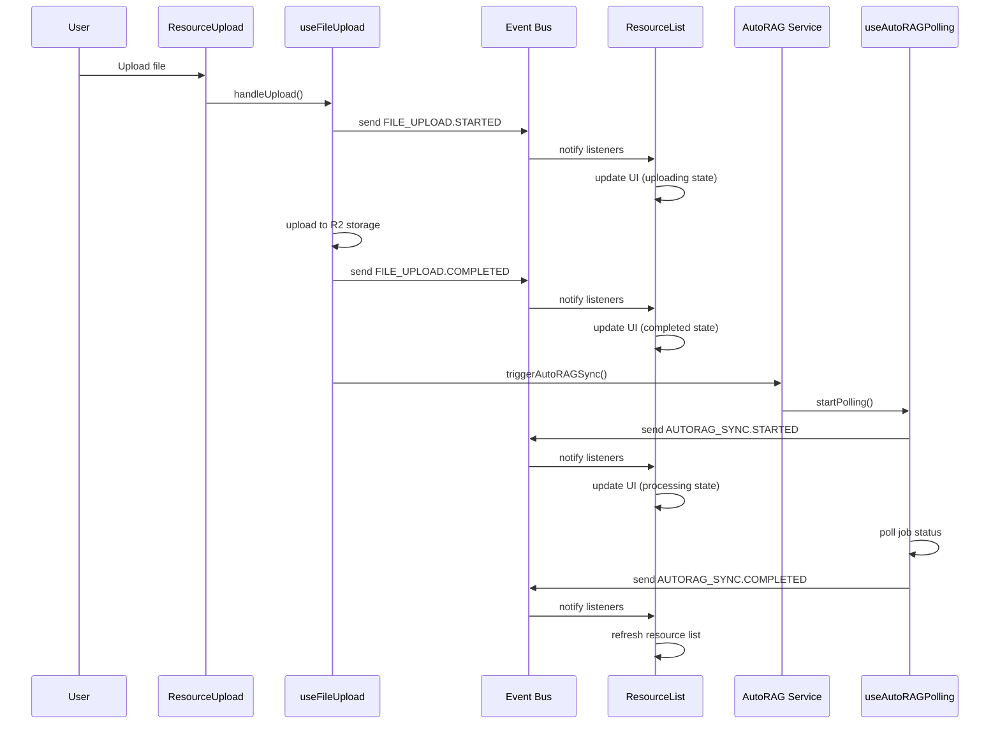
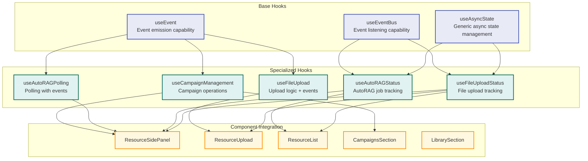
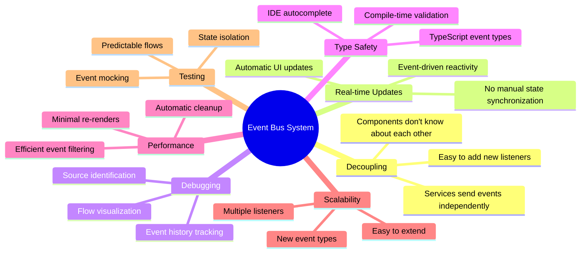

# Event Bus System Architecture

## System Overview

## Component Interaction Flow

## Event Types and Data Flow

```mermaid
graph LR
    subgraph "File Upload Events"
        FUS[FILE_UPLOAD.STARTED<br/>fileKey, filename]
        FUP[FILE_UPLOAD.PROGRESS<br/>fileKey, progress]
        FUC[FILE_UPLOAD.COMPLETED<br/>fileKey, filename]
        FUF[FILE_UPLOAD.FAILED<br/>fileKey, error]
    end

    subgraph "AutoRAG Events"
        ARS[AUTORAG_SYNC.STARTED<br/>ragId, jobId, fileKey]
        ARP[AUTORAG_SYNC.PROGRESS<br/>ragId, jobId, progress]
        ARC[AUTORAG_SYNC.COMPLETED<br/>ragId, jobId, fileKey]
        ARF[AUTORAG_SYNC.FAILED<br/>ragId, jobId, error]
    end

    subgraph "Campaign Events"
        CC[CAMPAIGN.CREATED<br/>campaignId, name]
        CU[CAMPAIGN.UPDATED<br/>campaignId, changes]
        CD[CAMPAIGN.DELETED<br/>campaignId]
    end

    subgraph "Snippet Events"
        SG[SNIPPET.GENERATED<br/>snippetId, campaignId]
        SA[SNIPPET.APPROVED<br/>snippetId, campaignId]
        SR[SNIPPET.REJECTED<br/>snippetId, campaignId]
    end

    %% Event flow connections
    FUS --> FUP
    FUP --> FUC
    FUP --> FUF
    FUC --> ARS
    ARS --> ARP
    ARP --> ARC
    ARP --> ARF
    ARC --> SG
    SG --> SA
    SG --> SR

    %% Styling
    classDef fileEvent fill:#e3f2fd,stroke:#1976d2,stroke-width:2px
    classDef autoragEvent fill:#f1f8e9,stroke:#388e3c,stroke-width:2px
    classDef campaignEvent fill:#fce4ec,stroke:#c2185b,stroke-width:2px
    classDef snippetEvent fill:#fff3e0,stroke:#f57c00,stroke-width:2px

    class FUS,FUP,FUC,FUF fileEvent
    class ARS,ARP,ARC,ARF autoragEvent
    class CC,CU,CD campaignEvent
    class SG,SA,SR snippetEvent
```

## Hook Architecture

## Benefits and Key Features

This architecture shows how the event bus system provides a clean, scalable solution for managing asynchronous state across the application, with clear separation of concerns and excellent debugging capabilities.
